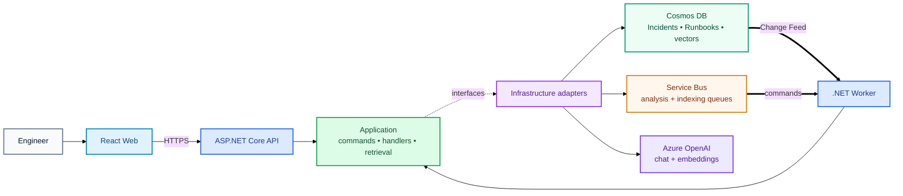

# IncidentIQ

**AI-powered incident analysis and operational support built with React, .NET, Azure, and vector search.**

IncidentIQ lets engineers submit Incidents, analyse them asynchronously, manage operational Runbooks, retrieve similar historical Incidents, and ask a grounded Operational Assistant questions about production issues.

> **Current status:** the core Stage 12 RAG workflow is implemented. Grounded Incident analysis has been verified in Azure; the Operational Assistant is implemented end-to-end locally and is awaiting final Azure verification.

## What It Can Do

- Submit, browse, search, and inspect Incidents through the React frontend.
- Process Incident analysis asynchronously through Cosmos Change Feed and Azure Service Bus.
- Ground AI analysis in similar historical Incidents and relevant Runbook chunks.
- Persist the exact evidence used by an Incident analysis.
- Create, edit, delete, index, and semantically search operational Runbooks.
- Index completed Incidents into a dedicated vector store for later retrieval.
- Ask the Operational Assistant natural-language engineering questions with `HI-*` and `RB-*` citations.
- Continue follow-up questions using ephemeral browser conversation history without treating chat history as evidence.
- Retry failed Incident analysis through the backend retry/requeue flow.

## Core Stack

| Area | Technology |
| --- | --- |
| **Frontend** | React, TypeScript, Vite |
| **Backend** | ASP.NET Core API, .NET Worker, Clean Architecture |
| **Data** | Azure Cosmos DB for NoSQL, Change Feed, vector search |
| **Messaging** | Azure Service Bus, transactional outbox, retries and DLQs |
| **AI** | Azure OpenAI structured generation and embeddings |
| **Cloud** | Azure Container Apps, Static Web Apps, ACR, Managed Identity/RBAC |
| **Observability** | OpenTelemetry, Application Insights, Log Analytics |
| **Delivery** | Bicep, GitHub Actions, OIDC |

## Architecture at a Glance

IncidentIQ keeps HTTP request handling, asynchronous processing, retrieval, and Azure-specific implementations separate.



The important dependency direction is:

```text
API / Worker
    ↓
Application use cases and interfaces
    ↓
Infrastructure implementations
    ↓
Cosmos DB / Service Bus / Azure OpenAI
```

Application code does not depend on Azure SDK types. Development can therefore swap the real AI implementations for deterministic local versions while keeping the same use cases.

## Grounded RAG in One Minute

Incident analysis and the Operational Assistant use the same broad retrieval model:

```text
Question or Incident
      ↓
one embedding
      ↓
historical Incident retrieval ─┐
                               ├─→ grounding context
Runbook chunk retrieval ───────┘
                               ↓
                        Azure OpenAI
                               ↓
                   structured grounded result
                               ↓
                     HI-* / RB-* validation
```

Historical Incidents and Runbooks stay separate because they mean different things:

- **Historical Incidents** show what happened previously.
- **Runbooks** provide operational guidance.
- Neither source is automatically proof of the current cause.

The generated `HI-*` and `RB-*` references are validated against the evidence actually supplied to the model. The Operational Assistant also receives recent conversation turns for continuity, but those turns are **not grounding evidence** and cannot be cited as such.

See [RAG & AI Design](docs/RAG-AND-AI.md) for the concise implementation explanation.

## Main Workflows

Detailed runtime diagrams live under [`docs/flows/`](docs/flows/README.md) so the root README stays readable.

| Flow | What it demonstrates |
| --- | --- |
| [Incident submission and analysis](docs/flows/incident-submission-and-analysis.md) | Transactional outbox, Change Feed, Service Bus, RAG analysis and atomic completion |
| [Runbook indexing](docs/flows/runbook-indexing.md) | Change Feed-driven chunking, embeddings and derived vector data |
| [Historical Incident indexing](docs/flows/historical-incident-indexing.md) | Completed Incidents becoming searchable vector evidence |
| [Grounded Incident analysis](docs/flows/grounded-incident-analysis.md) | One embedding, parallel retrieval, structured generation and persisted evidence |
| [Operational Assistant](docs/flows/operational-assistant.md) | Stateless multi-turn chat, fresh retrieval and answer-scoped evidence |

## Clean Architecture

IncidentIQ uses a pragmatic Clean Architecture split:

| Project | Responsibility |
| --- | --- |
| [`IncidentIQ.Domain`](src/IncidentIQ.Domain/ReadMe.md) | Business entities, state and invariants |
| [`IncidentIQ.Application`](src/IncidentIQ.Application/ReadMe.md) | Use cases, validation, contracts and provider-independent interfaces |
| [`IncidentIQ.Infrastructure`](src/IncidentIQ.Infrastructure/ReadMe.md) | Cosmos DB, Service Bus, Azure OpenAI and local adapters |
| [`IncidentIQ.Api`](src/IncidentIQ.Api/ReadMe.md) | HTTP contracts, controllers, API composition and synchronous queries |
| [`IncidentIQ.Worker`](src/IncidentIQ.Worker/ReadMe.md) | Change Feed relays and Service Bus consumers |
| [`IncidentIQ.Web`](src/IncidentIQ.Web/README.md) | Engineer-facing React application |
| [`infra`](infra/ReadMe.md) | Bicep, Azure resources, RBAC and deployment configuration |
| [`tests`](tests/ReadMe.md) | Unit, API, Worker, reliability and retrieval verification |

A few intentionally separate abstractions keep responsibilities clear:

| Abstraction | Responsibility | Examples |
| --- | --- | --- |
| **Repository** | Persistence around a source/domain entity | `IIncidentRepository`, `IRunbookRepository` |
| **Store** | Purpose-specific write boundary | `IIncidentSubmissionStore`, `IIncidentAnalysisStore`, `IRunbookChunkStore` |
| **Reader / Retriever** | Purpose-specific read or search | `IIncidentAnalysisReader`, `IRunbookChunkRetriever`, `IHistoricalIncidentRetriever` |
| **Queue** | Messaging boundary | `IIncidentAnalysisQueue`, `IRunbookIndexQueue` |
| **AI abstraction** | Provider-independent AI capability | `IIncidentAnalyzer`, `IEmbeddingGenerator`, `IOperationalAssistant` |

## Engineering Highlights

- **Durable asynchronous processing** — transactional outbox, Change Feed relays, Service Bus duplicate detection, bounded retries and DLQs.
- **Grounded AI** — analysis is supported by retrieved historical Incidents and Runbook chunks rather than prompt-only generation.
- **Evidence traceability** — the evidence used for Incident analysis is persisted, while Assistant responses return the exact evidence used for that answer.
- **Vector retrieval** — dedicated Cosmos vector containers for Runbook chunks and historical Incidents, with metadata filtering.
- **Structured model output** — JSON schemas constrain model shape; application validation checks semantic rules such as valid evidence references.
- **Provider-independent boundaries** — Application owns `IIncidentAnalyzer`, `IEmbeddingGenerator`, and `IOperationalAssistant`; Infrastructure owns Azure implementations.
- **Local-first development** — deterministic AI plus Cosmos/Service Bus emulators support normal development without Azure OpenAI calls.
- **Cloud-native identity** — deployed workloads use Managed Identity/RBAC, while GitHub Actions deploy through OIDC.

## Documentation

| Document | Purpose |
| --- | --- |
| [Component Architecture](docs/ARCHITECTURE.md) | Detailed API/Application/Worker/Infrastructure component view |
| [Flow diagrams](docs/flows/README.md) | End-to-end runtime flows for the main synchronous and asynchronous paths |
| [RAG & AI Design](docs/RAG-AND-AI.md) | Grounding, schemas, citation validation and LLM flow |
| [Development Guide](docs/DEVELOPMENT.md) | Normal local development and targeted Azure-connected debugging |
| [Design Decisions & Trade-offs](docs/DESIGN-DECISIONS.md) | Why the architecture is shaped this way |
| [Azure Dev Lifecycle](docs/INCIDENTIQ-AZURE-DEV-LIFECYCLE.md) | Create, recreate and verify the Azure development environment |
| [Infrastructure](infra/ReadMe.md) | Azure resources, Bicep, identities and RBAC |
| [Testing](tests/ReadMe.md) | Automated test boundaries and verification approach |
| [Troubleshooting](docs/TROUBLESHOOTING.md) | Common local and Azure-connected problems |
| [Roadmap](docs/ROADMAP.md) | Completed stages and planned work |

## Quick Start

### Normal local development

From the repository root:

```powershell
docker compose up --build
```

In `Development`, deterministic AI implementations are used. The main messaging, persistence, indexing, retrieval and Assistant flows can therefore be exercised without Azure OpenAI credentials.

Typical local endpoints:

```text
Web:                  http://localhost:5173
API Swagger:          https://localhost:7156/swagger
Cosmos Data Explorer: http://localhost:1234
```

### Targeted Azure-connected debugging

Use Azure-connected execution only when you need to verify a real dependency such as Azure OpenAI, Cosmos vector search, Service Bus, RBAC or telemetry.

The [Development Guide](docs/DEVELOPMENT.md) explains how to run the API or Worker locally against Azure, which credentials/configuration are required, and why Change Feed leases and shared queues need extra care.

## Testing

Run the backend suite from the repository root:

```powershell
dotnet test .\IncidentIQ.slnx
```

Build the React application with:

```powershell
cd src\IncidentIQ.Web
npm run build
```

See [`tests/ReadMe.md`](tests/ReadMe.md) for the testing strategy.

## Roadmap

Stage 12 introduces historical-Incident retrieval, grounded RAG analysis, and the Operational Assistant. The core implementation is complete; remaining work is final Azure Assistant verification and later AI evaluation/security/observability stages.

See the full [Development Roadmap](docs/ROADMAP.md).
