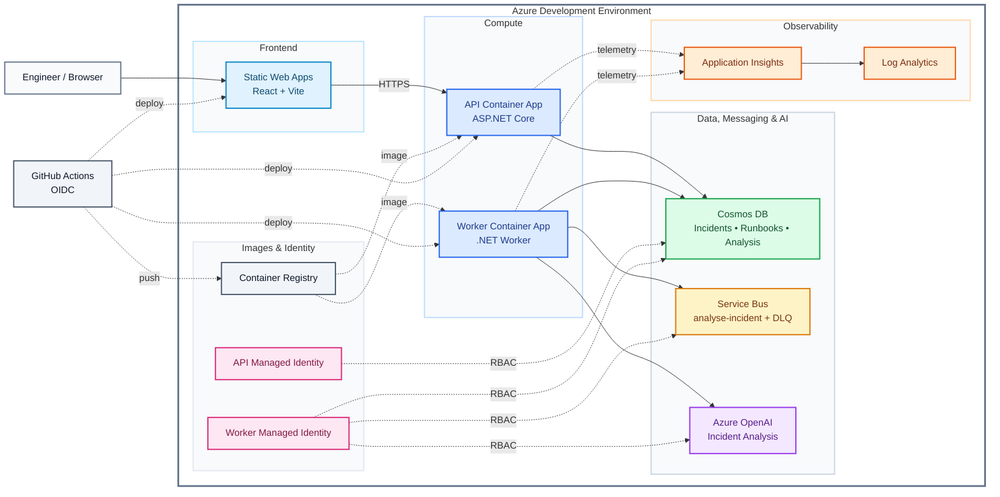
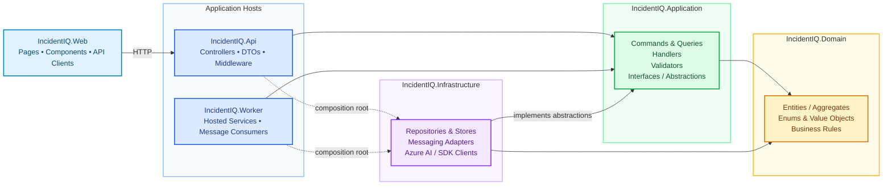
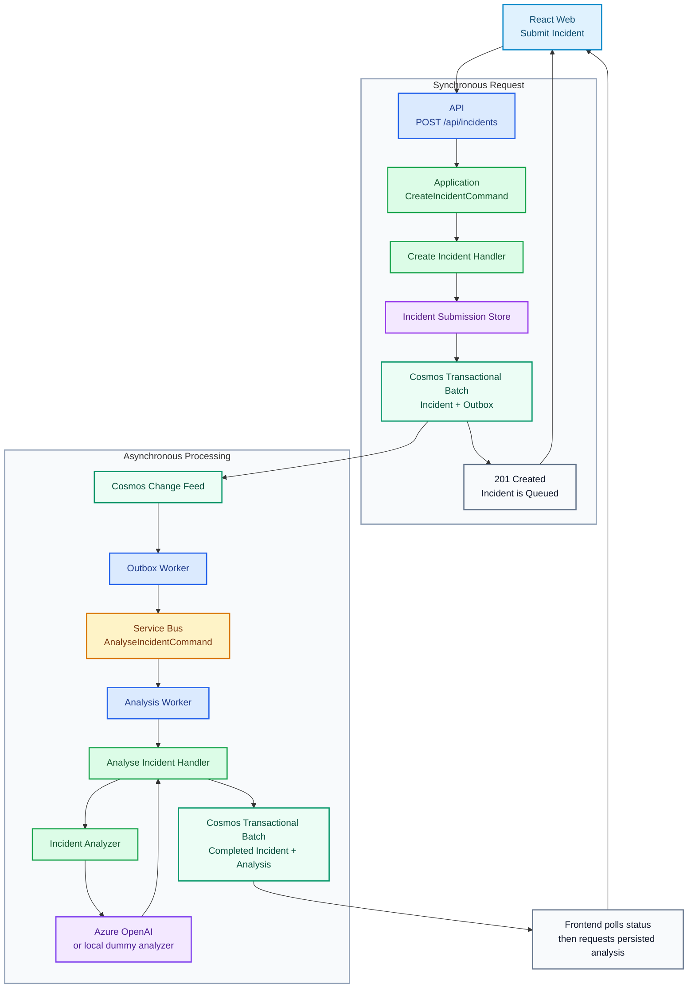

# IncidentIQ

IncidentIQ is an AI-powered incident analysis platform for engineers. Users submit technical incidents through a React frontend, and the system processes them asynchronously through Cosmos DB, Azure Service Bus, a .NET Worker, and Azure OpenAI.

The project is being built incrementally as a practical Azure/AI engineering project. The current system includes Incident and Runbook management, a transactional outbox, Service Bus reliability/DLQ handling, structured AI analysis, persisted analysis retrieval, frontend analysis display, bounded AI resilience, and structured AI telemetry. Local development uses deterministic AI output so the complete workflow can run without Azure OpenAI credentials.

## Architecture

### Clean Architecture

IncidentIQ follows a lightweight Clean Architecture approach: business rules sit at the centre, Application defines the use cases and abstractions around them, and the outer adapters connect those use cases to HTTP, background processing, persistence, messaging, and Azure services.


### 1. Azure Infrastructure Architecture

The deployed development environment is provisioned with Bicep. The main runtime, data, AI, identity, observability, and delivery components are grouped below so the Azure boundary is easier to read.



### 2. Internal Application Architecture

At code level, the solution keeps responsibilities separated by project. This diagram intentionally stays above individual classes and shows the important *types* of code each layer contains and the direction of dependencies.



### 3. Example Message Flow — Submit an Incident

A submitted Incident is persisted before it is queued. The API writes the Incident and outbox record atomically, then the asynchronous pipeline moves the command through Change Feed and Service Bus to the analysis Worker.



## Current Functionality

Engineers can currently:

- Submit, browse, search, and inspect Incidents.
- Track `Queued → Processing → Completed / Failed` without manually refreshing the page.
- View persisted AI-generated summaries, likely causes/confidence scores, recommended actions, model metadata, and analysis time.
- Create, view, edit, and delete operational Runbooks.
- Retry failed analysis through the backend retry/requeue capability.

Reliability and AI features currently include:

- Cosmos transactional outbox for Incident submission.
- Cosmos Change Feed relay to Service Bus.
- Stable command/message IDs and Service Bus duplicate detection.
- Basic state-based idempotency.
- Bounded Service Bus redelivery and DLQ handling.
- Atomic persistence of `Completed` Incident state + structured analysis.
- Separate analysis read path using `IIncidentAnalysisReader`.
- Deterministic local analyzer in `Development`.
- Azure OpenAI structured output outside `Development`.
- Bounded Azure AI SDK retries plus an overall request timeout.
- Failure classification for timeout, throttling, service/client failures, and invalid model responses.
- Structured AI success/failure logs with duration, model, deployment, and failure category.

## Projects

| Project                                                       | Responsibility                                                                     |
| ------------------------------------------------------------- | ---------------------------------------------------------------------------------- |
| [`IncidentIQ.Web`](src/IncidentIQ.Web/)                       | React frontend for Incidents, Runbooks, and persisted AI analysis                  |
| [`IncidentIQ.Api`](src/IncidentIQ.Api/)                       | ASP.NET Core HTTP API and Problem Details boundary                                 |
| [`IncidentIQ.Worker`](src/IncidentIQ.Worker/)                 | Change Feed outbox relay and Service Bus analysis processing                       |
| [`IncidentIQ.Domain`](src/IncidentIQ.Domain/)                 | Core business models and lifecycle rules                                           |
| [`IncidentIQ.Application`](src/IncidentIQ.Application/)       | Use cases, handlers, validation, and external-service abstractions                 |
| [`IncidentIQ.Infrastructure`](src/IncidentIQ.Infrastructure/) | Cosmos DB, Service Bus, Azure OpenAI, local AI, and Azure SDK implementations      |
| [`infra`](infra/)                                             | Bicep, identities/RBAC, deployment configuration, and local emulator configuration |
| [`tests`](tests/)                                             | Application, API, Worker, and reliability tests                                    |

## Documentation

| Document                                                      | Purpose                                                                               |
| ------------------------------------------------------------- | ------------------------------------------------------------------------------------- |
| [Development Guide](docs/DEVELOPMENT.md)                      | Run IncidentIQ locally with emulators/dummy AI or locally against Azure               |
| [Design Decisions & Trade-offs](docs/DESIGN-DECISIONS.md)     | Messaging, reliability, outbox, idempotency, AI resilience, and persistence decisions |
| [Azure Dev Lifecycle](docs/INCIDENTIQ-AZURE-DEV-LIFECYCLE.md) | Create, tear down, recreate, and reconfigure the Azure dev environment                |
| [Infrastructure](infra/ReadMe.md)                             | Bicep structure, Azure resources, identities, RBAC, and resource ownership            |
| [Testing](tests/ReadMe.md)                                    | Automated test boundaries and manual end-to-end verification                          |
| [Roadmap](docs/ROADMAP.md)                                    | Completed stages and planned work                                                     |
| [Troubleshooting](docs/TROUBLESHOOTING.md)                    | Common local Docker, Cosmos, Service Bus, DI, and AI configuration issues             |

Each main project also has its own README for implementation-specific responsibilities.

## Quick Start

### Docker Compose — normal local development

IncidentIQ has Visual Studio Container/Compose support. Select the appropriate Docker Compose debug target and start debugging, or run from the repository root:

```powershell
docker compose up --build
```

The local Worker runs with `DOTNET_ENVIRONMENT=Development`, so `IIncidentAnalyzer` resolves to `DevelopmentDummyIncidentAnalyzer`. The full asynchronous workflow therefore works locally without Azure OpenAI credentials.

Typical local endpoints:

- API Swagger: `https://localhost:7156/swagger`
- Web: `http://localhost:5173`
- Cosmos DB Emulator/Data Explorer: `http://localhost:1234/`

Local `.env` values are used for emulator credentials. See the [Development Guide](docs/DEVELOPMENT.md) for the exact setup.

### Azure-connected development

Use the Azure-connected mode when you specifically want to verify real Cosmos DB, Service Bus, Azure OpenAI, Managed Identity/RBAC, or Application Insights behaviour. Configuration and login instructions are in the [Development Guide](docs/DEVELOPMENT.md) and [Azure Dev Lifecycle](docs/INCIDENTIQ-AZURE-DEV-LIFECYCLE.md).

## Testing

Run the backend test suite from the repository root:

```powershell
dotnet test
```

See [tests/ReadMe.md](tests/ReadMe.md) for the testing strategy and reliability checks.

## Troubleshooting

See the [Troubleshooting Guide](docs/TROUBLESHOOTING.md) for common development issues and resolutions.

## Roadmap

Stage 10 delivers the first complete Azure AI incident-analysis flow. The next stage adds Runbook chunking, embeddings, Cosmos vector search, and retrieval for RAG.

See the full [Development Roadmap](docs/ROADMAP.md).
