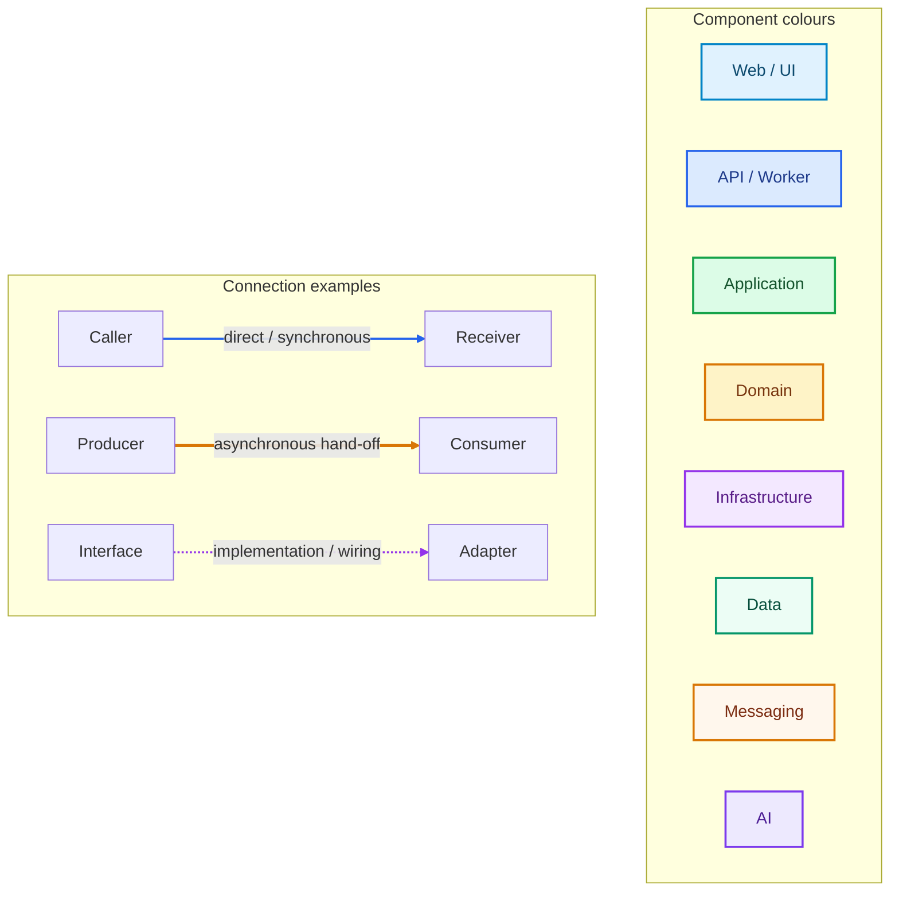
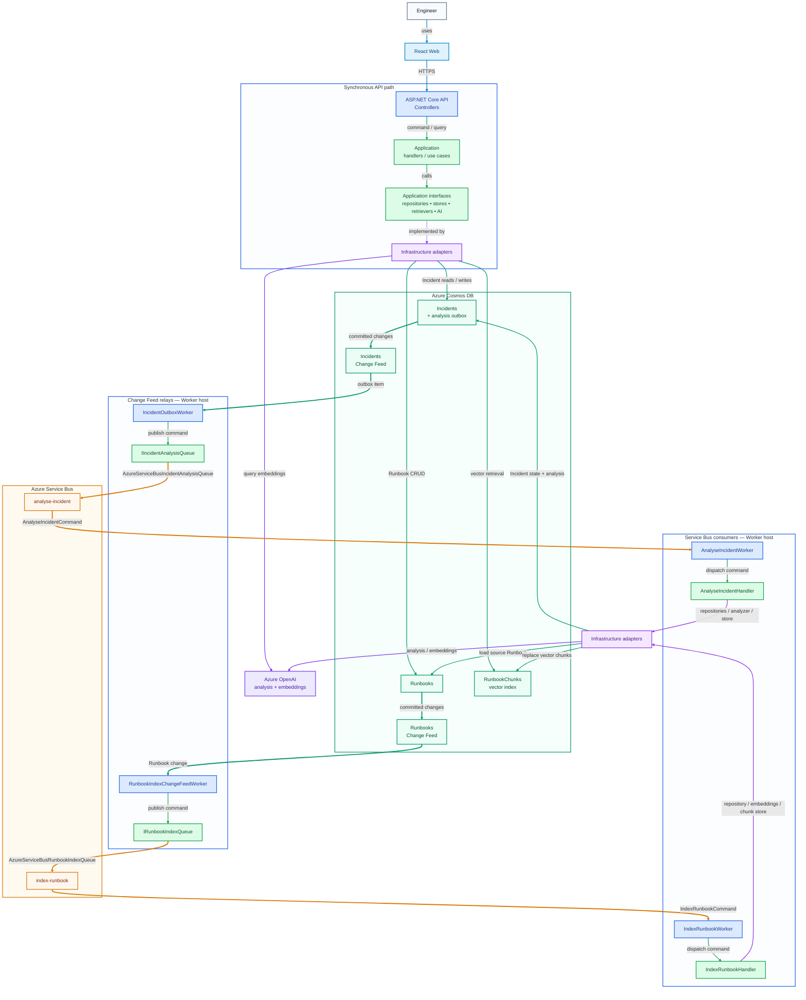
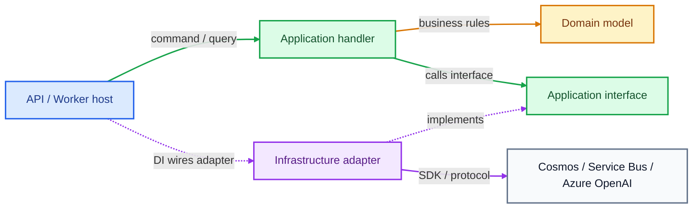
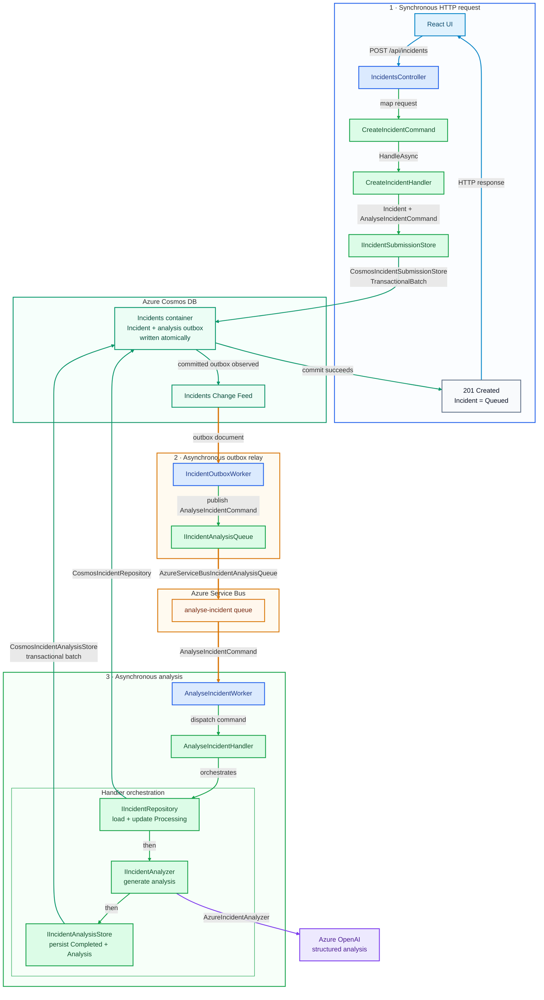
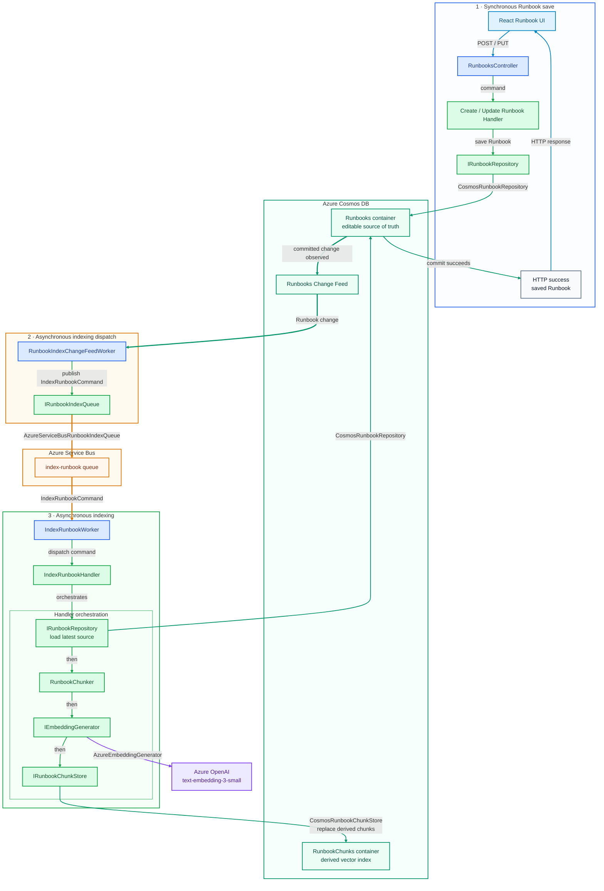
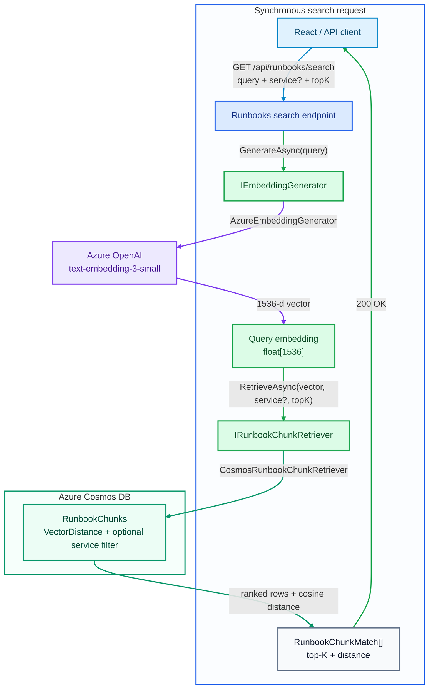

# IncidentIQ

**AI-powered incident analysis built with React, .NET, Azure, and vector search.**

IncidentIQ helps engineers submit technical incidents, process analysis asynchronously, manage operational Runbooks, and search indexed Runbook content semantically. The deployed development environment uses Azure OpenAI for structured analysis and embeddings, with Cosmos DB for persistence and vector retrieval.

> **Current status:** Runbook ingestion and semantic vector search are complete. The next stage adds historical-Incident retrieval and combines both evidence sources into grounded RAG analysis.

## What It Can Do

- Submit, browse, search, and inspect Incidents through the React frontend.
- Track analysis through `Queued → Processing → Completed / Failed`.
- Review persisted AI summaries, likely causes, confidence scores, recommended actions, model metadata, and analysis time.
- Create, view, edit, and delete operational Runbooks.
- Index Runbooks asynchronously and search their content semantically with top-K vector retrieval and optional service filtering.
- Retry failed Incident analysis through the backend retry/requeue flow.

## Core Stack

| Area              | Technology                                                        |
| ----------------- | ----------------------------------------------------------------- |
| **Frontend**      | React, TypeScript, Vite                                           |
| **Backend**       | ASP.NET Core API, .NET Worker, Clean Architecture                 |
| **Data**          | Azure Cosmos DB for NoSQL, Change Feed, vector search             |
| **Messaging**     | Azure Service Bus, transactional outbox, retries and DLQs         |
| **AI**            | Azure OpenAI structured analysis and embeddings                   |
| **Cloud**         | Azure Container Apps, Static Web Apps, ACR, Managed Identity/RBAC |
| **Observability** | OpenTelemetry, Application Insights, Log Analytics                |
| **Delivery**      | Bicep, GitHub Actions, OIDC                                       |

## Architecture at a Glance

IncidentIQ separates synchronous HTTP work from asynchronous background processing. The diagrams below use the same colours and arrow styles throughout.

### Diagram Key



- **Solid arrow** — the caller waits for the operation or result.
- **Thick arrow** — asynchronous delivery through Change Feed or Service Bus.
- **Dotted arrow** — implementation, dependency-injection, deployment, telemetry, or RBAC relationship.

### System Overview

The API and Workers do **not** call Cosmos DB, Service Bus, or Azure OpenAI directly. They invoke Application handlers/use cases, which depend on Application interfaces; Infrastructure supplies the Azure-specific implementations through dependency injection.

The external Azure services are shown as separate boundaries below so the synchronous API path and asynchronous background paths are easy to follow.



The key architectural boundary is now visible in both directions: **HTTP work reaches Azure services only through Application interfaces and Infrastructure adapters**, while background work starts from Cosmos Change Feed or Service Bus and then enters the same Application layer.


### Clean Architecture

IncidentIQ uses a lightweight Clean Architecture approach. Domain and Application code stay independent of Azure SDKs and persistence technologies; Infrastructure provides the concrete adapters, and the API/Worker hosts wire them together with dependency injection.

<p align="center">
  
</p>



For example, an Application handler can depend on `IRunbookChunkRetriever` without knowing that the deployed implementation is `CosmosRunbookChunkRetriever`.

| Abstraction            | Responsibility                            | Examples                                                                   |
| ---------------------- | ----------------------------------------- | -------------------------------------------------------------------------- |
| **Repository**         | Persistence around a source/domain entity | `IIncidentRepository`, `IRunbookRepository`                                |
| **Store**              | Purpose-specific write boundary           | `IIncidentSubmissionStore`, `IIncidentAnalysisStore`, `IRunbookChunkStore` |
| **Reader / Retriever** | Purpose-specific read or search           | `IIncidentAnalysisReader`, `IRunbookChunkRetriever`                        |
| **Queue**              | Messaging boundary                        | `IIncidentAnalysisQueue`, `IRunbookIndexQueue`                             |
| **AI abstraction**     | Provider-independent AI capability        | `IIncidentAnalyzer`, `IEmbeddingGenerator`                                 |

## Key Workflows

These diagrams show the runtime flow only. The component READMEs contain the implementation-level class and configuration details.

### 1. Submit and Analyse an Incident

Incident submission is synchronous only until the Incident and its analysis outbox entry are committed to Cosmos. The HTTP request can then return; dispatch and AI analysis continue independently.



The transactional outbox is what makes this reliable: the Incident and `AnalyseIncidentCommand` outbox record succeed or fail together. `IncidentOutboxWorker` later relays that durable request to Service Bus; it does **not** perform the analysis itself.

The frontend can poll the Incident while it is `Queued` or `Processing`, then retrieve the persisted analysis once processing completes.


### 2. Index a Runbook

Runbook CRUD and vector indexing are deliberately separate. The editable Runbook is saved synchronously first; Cosmos Change Feed then starts the asynchronous indexing pipeline.



`IndexRunbookCommand` carries the Runbook identity rather than the full document. `IndexRunbookHandler` reloads the current Runbook, chunks it, generates embeddings, then replaces that Runbook's derived vector-search chunks.

`RunbookChunks` are search data rather than the editable source of truth. Re-indexing replaces stale chunks, and deleting a Runbook also removes its derived chunks.


### 3. Search Runbooks Semantically

Semantic search is different from indexing: it is a **fully synchronous** request/response path. The API still does not query Cosmos or Azure OpenAI directly; it works through Application abstractions whose implementations live in Infrastructure.



There is **no Change Feed or Service Bus hop** in search. The caller waits for both embedding generation and Cosmos vector retrieval before receiving the response. Smaller cosine distance means a stronger match; retrieval also records latency and Cosmos Request Unit (RU) consumption.


## Engineering Highlights

- **Clean Architecture + dependency inversion** — Application owns use cases and interfaces; Infrastructure owns Azure-specific implementations.
- **Durable asynchronous processing** — Cosmos transactional outbox, Change Feed relays, Service Bus commands, duplicate detection, bounded retries, and DLQs.
- **Structured AI analysis** — persisted summaries, likely causes, confidence scores, recommended actions, and model metadata.
- **Runbook ingestion pipeline** — deterministic overlapping chunking, embeddings, replace-based re-indexing, and stale-data cleanup.
- **Vector search** — Cosmos `VectorDistance`, 1536-dimension `float32` cosine vectors, top-K retrieval, service filtering, latency, and RU telemetry.
- **Cloud-native security** — Managed Identity/RBAC for workloads and GitHub OIDC for deployments.
- **Observability** — OpenTelemetry, Application Insights, Log Analytics, correlation IDs, and operational telemetry.
- **Local-first development** — Cosmos/Service Bus emulators and deterministic AI implementations allow the main workflows to run without Azure OpenAI credentials.

## Projects

The summaries below are intentionally high-level. Each project name links to its own README for implementation details.

| Project                                                                | High-level responsibility                                                                                                |
| ---------------------------------------------------------------------- | ------------------------------------------------------------------------------------------------------------------------ |
| [`IncidentIQ.Web`](src/IncidentIQ.Web/README.md)                       | **Engineer UI** — React pages and API clients for Incidents, analysis, and Runbooks.                                     |
| [`IncidentIQ.Api`](src/IncidentIQ.Api/ReadMe.md)                       | **HTTP host** — controllers, HTTP contracts, validation/error presentation, synchronous search, and DI composition root. |
| [`IncidentIQ.Worker`](src/IncidentIQ.Worker/ReadMe.md)                 | **Async host** — Change Feed relays and Service Bus consumers for Incident analysis and Runbook indexing.                |
| [`IncidentIQ.Domain`](src/IncidentIQ.Domain/ReadMe.md)                 | **Business core** — domain entities, lifecycle/state rules, and invariants with no Azure or persistence dependency.      |
| [`IncidentIQ.Application`](src/IncidentIQ.Application/ReadMe.md)       | **Use-case layer** — commands/queries, handlers, validation, application models, and provider-independent interfaces.    |
| [`IncidentIQ.Infrastructure`](src/IncidentIQ.Infrastructure/ReadMe.md) | **External adapters** — Cosmos DB, Service Bus, Azure OpenAI, and deterministic local implementations.                   |
| [`infra`](infra/ReadMe.md)                                             | **Infrastructure as Code** — Bicep, Azure resources, Managed Identity/RBAC, monitoring, and deployment configuration.    |
| [`tests`](tests/ReadMe.md)                                             | **Verification** — Application/API/Worker tests plus reliability, indexing, and vector-retrieval coverage.               |

## Documentation

| Document                                                      | Purpose                                                                                |
| ------------------------------------------------------------- | -------------------------------------------------------------------------------------- |
| [Development Guide](docs/DEVELOPMENT.md)                      | Local development and Azure-connected verification                                     |
| [Design Decisions & Trade-offs](docs/DESIGN-DECISIONS.md)     | Architecture rationale for messaging, persistence, AI, ingestion, and vector retrieval |
| [Azure Dev Lifecycle](docs/INCIDENTIQ-AZURE-DEV-LIFECYCLE.md) | Create, tear down, recreate, configure, and verify the Azure dev environment           |
| [Infrastructure](infra/ReadMe.md)                             | Bicep structure, Azure resources, identities, RBAC, and ownership                      |
| [Testing](tests/ReadMe.md)                                    | Automated test boundaries and end-to-end verification                                  |
| [Roadmap](docs/ROADMAP.md)                                    | Completed stages and planned work                                                      |
| [Troubleshooting](docs/TROUBLESHOOTING.md)                    | Common Docker, Cosmos, Service Bus, AI, ingestion, and vector-search issues            |

## Quick Start

### Docker Compose — normal local development

IncidentIQ supports Visual Studio Docker Compose debugging. From the repository root:

```powershell
docker compose up --build
```

In `Development`, deterministic local AI implementations are used, so Incident analysis, Runbook ingestion, and semantic search can be exercised without Azure OpenAI credentials.

Typical local endpoints:

```text
Web:                  http://localhost:5173
API Swagger:          https://localhost:7156/swagger
Cosmos Data Explorer: http://localhost:1234
```

See the [Development Guide](docs/DEVELOPMENT.md) for configuration and verification steps.

### Azure-connected development

Use Azure-connected execution to verify real Cosmos DB, Service Bus, Azure OpenAI, Managed Identity/RBAC, Application Insights, or deployed vector-search behaviour.

See the [Development Guide](docs/DEVELOPMENT.md) and [Azure Dev Lifecycle](docs/INCIDENTIQ-AZURE-DEV-LIFECYCLE.md).

## Testing

Run the backend test suite from the repository root:

```powershell
dotnet test .\IncidentIQ.slnx
```

See [`tests/ReadMe.md`](tests/ReadMe.md) for the testing strategy.

## Roadmap

**Stage 11 — Runbook ingestion and vector search — is complete.**

Stage 12 adds:

1. **Historical Incident Vector Retrieval** — searchable historical Incident embeddings and similar-Incident retrieval.
2. **Grounded RAG Analysis** — combine retrieved Incident and Runbook evidence and feed it into the AI analysis pipeline.

See the full [Development Roadmap](docs/ROADMAP.md).
