# IncidentIQ

**AI-powered incident analysis and operational support built with React, .NET, Azure, and vector search.**

IncidentIQ lets engineers submit Incidents, analyse them asynchronously, manage Runbooks, retrieve similar historical Incidents, and ask a grounded Operational Assistant questions about production issues.

> **Current status:** Microsoft Entra authentication is working end-to-end locally. Stage 14C role-based authorization is next.

## Features

- Incident submission, dashboard, status polling and grounded analysis.
- Runbook CRUD, asynchronous indexing and semantic search.
- Historical Incident vector indexing and similarity retrieval.
- Grounded RAG using historical Incidents (`HI-*`) and Runbooks (`RB-*`).
- Operational Assistant with answer-scoped evidence and browser-only conversation state.
- Transactional outbox, Service Bus retries, duplicate detection and DLQs.
- Microsoft Entra login with protected API access.
- Azure deployment through Bicep and GitHub Actions OIDC.
- Managed Identity/RBAC for Azure workloads.
- Repeatable retrieval/citation evaluation.

## Stack

| Area | Technology |
| --- | --- |
| Frontend | React, TypeScript, Vite, MSAL |
| Backend | ASP.NET Core, .NET Worker, Clean Architecture |
| Data | Azure Cosmos DB for NoSQL, Change Feed, vector search |
| Messaging | Azure Service Bus |
| AI | Azure OpenAI |
| Cloud | Container Apps, Static Web Apps, ACR, Managed Identity/RBAC |
| Observability | Application Insights, Log Analytics, OpenTelemetry |
| Delivery | Bicep, GitHub Actions, OIDC |

## Architecture

```mermaid
%%{init: {"theme":"base","themeVariables":{"background":"#ffffff"}} }%%
flowchart LR
    User["Engineer"]:::user --> Entra["Microsoft Entra ID"]:::identity
    Entra --> Web["React + MSAL"]:::web
    Web -->|"Bearer token<br/>access_as_user"| API["ASP.NET Core API"]:::host

    API --> App["Application"]:::app
    Worker[".NET Worker"]:::host --> App
    App -. interfaces .-> Infra["Infrastructure"]:::infra

    Infra --> Cosmos["Cosmos DB"]:::data
    Infra --> Bus["Service Bus"]:::msg
    Infra --> AI["Azure OpenAI"]:::ai

    Cosmos ==>|Change Feed| Worker
    Bus ==>|Commands| Worker

    API -. "Managed Identity" .-> Cosmos
    API -. "Managed Identity" .-> AI
    Worker -. "Managed Identity" .-> Cosmos
    Worker -. "Managed Identity" .-> Bus
    Worker -. "Managed Identity" .-> AI

    classDef user fill:#f8fafc,stroke:#64748b,color:#0f172a,stroke-width:2px;
    classDef identity fill:#fef3c7,stroke:#d97706,color:#78350f,stroke-width:2px;
    classDef web fill:#e0f2fe,stroke:#0284c7,color:#0c4a6e,stroke-width:2px;
    classDef host fill:#dbeafe,stroke:#2563eb,color:#1e3a8a,stroke-width:2px;
    classDef app fill:#dcfce7,stroke:#16a34a,color:#14532d,stroke-width:2px;
    classDef infra fill:#f3e8ff,stroke:#9333ea,color:#581c87,stroke-width:2px;
    classDef data fill:#ecfdf5,stroke:#059669,color:#064e3b,stroke-width:2px;
    classDef msg fill:#fff7ed,stroke:#d97706,color:#7c2d12,stroke-width:2px;
    classDef ai fill:#ede9fe,stroke:#7c3aed,color:#4c1d95,stroke-width:2px;
```



Two identity boundaries are intentionally separate:

- **Users → IncidentIQ:** Microsoft Entra access tokens.
- **API/Worker → Azure:** Managed Identity and Azure RBAC.

See [Architecture](docs/ARCHITECTURE.md) and [Design Decisions](docs/DESIGN-DECISIONS.md).

## Main Flow

```text
Submit Incident
→ Cosmos: Incident + outbox (transactional batch)
→ Cosmos Change Feed
→ Service Bus: analyse-incident
→ Worker
→ historical Incident + Runbook retrieval
→ Azure OpenAI
→ validate HI-* / RB-* references
→ persist Completed Incident + analysis + evidence
```

Detailed diagrams: [docs/flows](docs/flows/README.md).

## Project Structure

```text
src/
├── IncidentIQ.Domain
├── IncidentIQ.Application
├── IncidentIQ.Infrastructure
├── IncidentIQ.Api
├── IncidentIQ.Worker
└── IncidentIQ.Web

tests/
infra/
tools/IncidentIQ.Evaluation/
docs/
```

## Quick Start

### 1. Prerequisites

- .NET 10 SDK
- Node.js/npm
- Docker Desktop
- Azure CLI
- A Microsoft Entra tenant

### 2. Create the Entra app registrations

Create two **single-tenant** app registrations.

**IncidentIQ API**
- Name: `IncidentIQ API`
- Expose Application ID URI: `api://<API_CLIENT_ID>`
- Add delegated scope: `access_as_user`
- No client secret required.

**IncidentIQ Web**
- Name: `IncidentIQ Web`
- Platform: Single-page application (SPA)
- Redirect URIs:
  - `http://localhost:5173`
  - your Azure Static Web Apps URL
- Add delegated permission to `IncidentIQ API / access_as_user`
- No client secret required.

### 3. Configure local environment values

Repository-root `.env`:

```env
COSMOS_EMULATOR_KEY=<COSMOS_EMULATOR_KEY>
SERVICEBUS_SQL_PASSWORD=<LOCAL_SQL_PASSWORD>
```

API user-secrets (`secrets.json` outside the repo):

```powershell
dotnet user-secrets set "AzureAd:TenantId" "<TENANT_ID>" --project src\IncidentIQ.Api
dotnet user-secrets set "AzureAd:ClientId" "<API_CLIENT_ID>" --project src\IncidentIQ.Api
dotnet user-secrets set "Kestrel:Certificates:Development:Password" "<DEV_CERT_PASSWORD>" --project src\IncidentIQ.Api
```

Frontend `src/IncidentIQ.Web/.env.local`:

```env
VITE_ENTRA_TENANT_ID=<TENANT_ID>
VITE_ENTRA_CLIENT_ID=<INCIDENTIQ_WEB_CLIENT_ID>
VITE_API_SCOPE=api://<INCIDENTIQ_API_CLIENT_ID>/access_as_user
```

`VITE_API_BASE_URL` is already defined in `.env.development`.

### 4. Start locally

```powershell
docker compose up --build
```

Typical endpoints:

```text
Web:                  http://localhost:5173
API Swagger:          https://localhost:7156/swagger
Cosmos Data Explorer: http://localhost:1234
```

Normal `Development` uses deterministic AI. To test against Azure OpenAI locally, set `Development:UseLiveAzureAI=true` through user-secrets; see [Development](docs/DEVELOPMENT.md).

## Testing

```powershell
dotnet test .\IncidentIQ.slnx

cd src\IncidentIQ.Web
npm run build
npm run lint
```

## Documentation

- [Architecture](docs/ARCHITECTURE.md)
- [Runtime flows](docs/flows/README.md)
- [RAG & AI](docs/RAG-AND-AI.md)
- [AI evaluation](docs/AI-EVALUATION.md)
- [Development](docs/DEVELOPMENT.md)
- [Azure lifecycle](docs/INCIDENTIQ-AZURE-DEV-LIFECYCLE.md)
- [Design decisions](docs/DESIGN-DECISIONS.md)
- [Troubleshooting](docs/TROUBLESHOOTING.md)
- [Roadmap](docs/ROADMAP.md)
