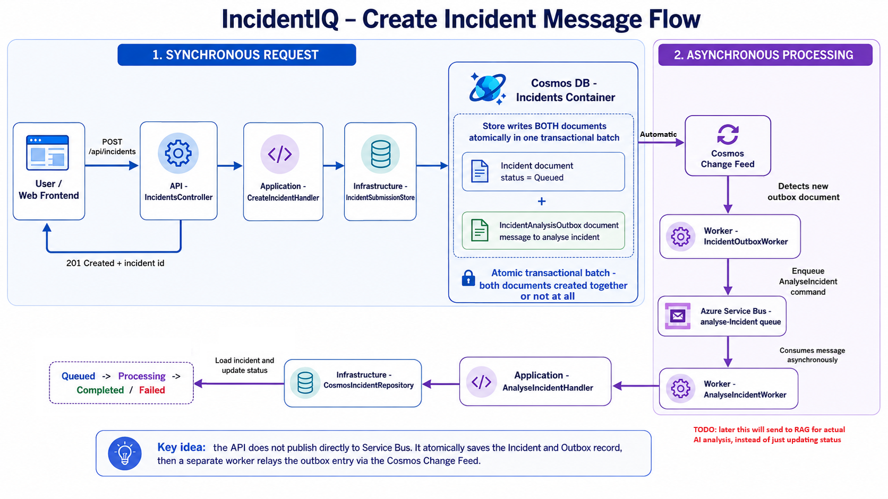
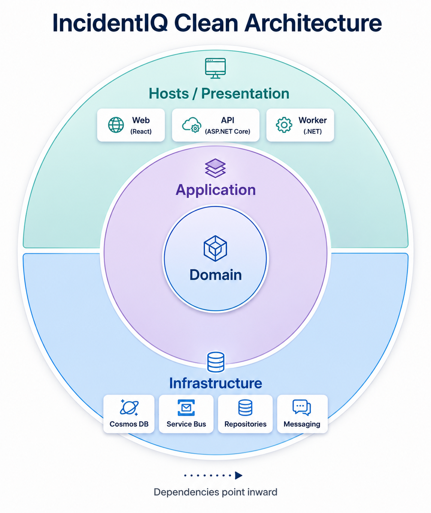

# IncidentIQ

IncidentIQ is an AI-powered incident analysis platform for engineers. Users submit technical incidents through a React frontend, and the backend processes them asynchronously through Cosmos DB, Azure Service Bus, and a .NET Worker.

The project is being built incrementally as a practical Azure/AI engineering project. The current system implements incident and Runbook management, asynchronous incident processing, reliability handling, and a transactional outbox. Later stages add Azure AI, vector retrieval, RAG, scaling, security, and operations tooling.

## Architecture

### Create Incident Flow



At a high level:

```text
React
  ↓
ASP.NET Core API
  ↓
Application
  ↓
Cosmos transactional batch
  ├── Incident
  └── Analysis Outbox
          ↓
     Change Feed
          ↓
   Outbox Worker
          ↓
     Service Bus
          ↓
  Analysis Worker
          ↓
    Cosmos update
          ↓
 React status polling
```

The API does **not** directly publish the analysis command to Service Bus. The Incident and analysis request are stored atomically in Cosmos, then relayed asynchronously through the Cosmos Change Feed.

### Clean Architecture



IncidentIQ uses a lightweight Clean Architecture approach:

```text
Hosts
├── IncidentIQ.Web
├── IncidentIQ.Api
└── IncidentIQ.Worker
        ↓
IncidentIQ.Application
        ↓
IncidentIQ.Domain

IncidentIQ.Infrastructure
        ↑
implements Application abstractions
```

- **Domain** contains business models and lifecycle rules.
- **Application** contains use cases, handlers, validation, and abstractions.
- **Infrastructure** implements Cosmos DB, Service Bus, and other external integrations.
- **API / Worker / Web** are application hosts and presentation boundaries.

## Current Functionality

Engineers can currently submit and browse incidents, track asynchronous processing status, and create, view, edit, and delete operational Runbooks.

Incident processing currently supports:

```text
Queued → Processing → Completed
                  └──→ Failed
```

Reliability features include Service Bus retries, DLQ handling, processing-attempt metadata, basic state-based idempotency, duplicate detection, and a Cosmos transactional outbox.

## Projects

| Project | Responsibility |
|---|---|
| [`IncidentIQ.Web`](src/IncidentIQ.Web/) | React frontend for incidents, Runbooks, and future analysis/operations views |
| [`IncidentIQ.Api`](src/IncidentIQ.Api/) | ASP.NET Core HTTP API |
| [`IncidentIQ.Worker`](src/IncidentIQ.Worker/) | Outbox relay and asynchronous incident processing |
| [`IncidentIQ.Domain`](src/IncidentIQ.Domain/) | Core business models and rules |
| [`IncidentIQ.Application`](src/IncidentIQ.Application/) | Use cases, handlers, validation, and abstractions |
| [`IncidentIQ.Infrastructure`](src/IncidentIQ.Infrastructure/) | Cosmos DB, Service Bus, and external-service implementations |
| [`infra`](infra/) | Bicep, Azure bootstrap, deployment configuration, and local emulator configuration |
| [`tests`](tests/) | Application, API, and Worker tests |

## Documentation

| Document | Purpose |
|---|---|
| [Development Guide](docs/DEVELOPMENT.md) | Run IncidentIQ locally or against Azure development resources |
| [Design Decisions & Trade-offs](docs/DESIGN-DECISIONS.md) | Reliability, messaging, idempotency, DLQ, and outbox decisions |
| [Azure Dev Lifecycle](docs/INCIDENTIQ-AZURE-DEV-LIFECYCLE.md) | Create, tear down, recreate, and reconfigure the Azure dev environment |
| [Infrastructure](infra/ReadMe.md) | Bicep structure, Azure resources, identities, and resource ownership |
| [Testing](tests/ReadMe.md) | Test projects, test boundaries, and local end-to-end verification |
| [Roadmap](docs/ROADMAP.md) | Current development progress and planned stages |

Each main project also has its own README for implementation-specific responsibilities.

## Quick Start

### Docker-Compose

**For normal local development**, as the project has enabled Container, and Container Orchestration Support within **Visual Studio** you should be able to select in the **Debug Target** dropdown the appropriate service (e.g., `docker-compose`) then click **debug** to run the application within the containerized environment along with debugging support.

After doing so you can then find:
- API: https://localhost:7156/swagger
- Web: http://localhost:5173
- Cosmos DB Emulator: http://localhost:1234/

#### Connected to Azure

- If instead you wish to connect to the real, non-emulated Azure services, you will need to configure the appropriate environment variables and credentials as described in the [Development Guide](docs/DEVELOPMENT.md), and then run either outside of Docker-Compose, or modify the Docker-Compose setup environment variables and secrets to use those Azure services.

## Testing

Run the backend test suite from the repository root:

```powershell
dotnet test
```

See [tests/ReadMe.md](tests/ReadMe.md) for the testing strategy and end-to-end reliability checks.

## Roadmap

The current work is in **Stage 8 — Reliability & Messaging**. The transactional outbox and Change Feed relay are implemented; admin retry/requeue and additional reliability/duplicate-message tests remain.

See the full [Development Roadmap](docs/ROADMAP.md).
