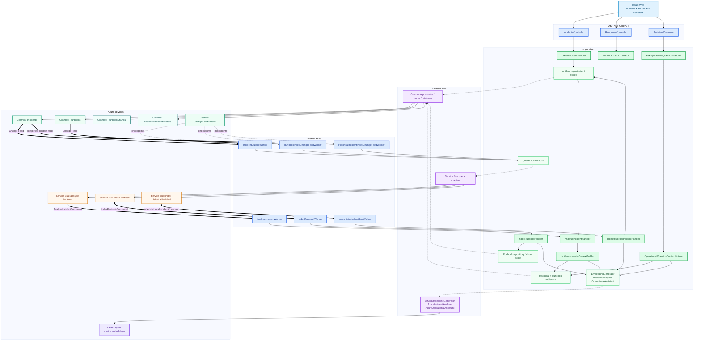

# IncidentIQ Component Architecture

This page is the detailed counterpart to the simplified diagram in the root README. It shows the main Application handlers, asynchronous Workers, Infrastructure adapters and Azure services without documenting every class.

## How to read it

- **API and Worker are hosts.** They receive HTTP, Change Feed or Service Bus work and enter Application.
- **Application owns orchestration.** Commands, handlers, context builders and interfaces describe the use cases.
- **Infrastructure owns provider details.** Cosmos queries, Service Bus SDK calls and Azure OpenAI SDK calls stay outside Application.
- **`Incidents` and `Runbooks` are source data.** `HistoricalIncidentVectors` and `RunbookChunks` are derived retrieval indexes.
- **Synchronous paths** include Runbook search and the Operational Assistant.
- **Asynchronous paths** include Incident analysis, Runbook indexing and historical Incident indexing.

For step-by-step runtime diagrams, see [`docs/flows/`](flows/README.md).
