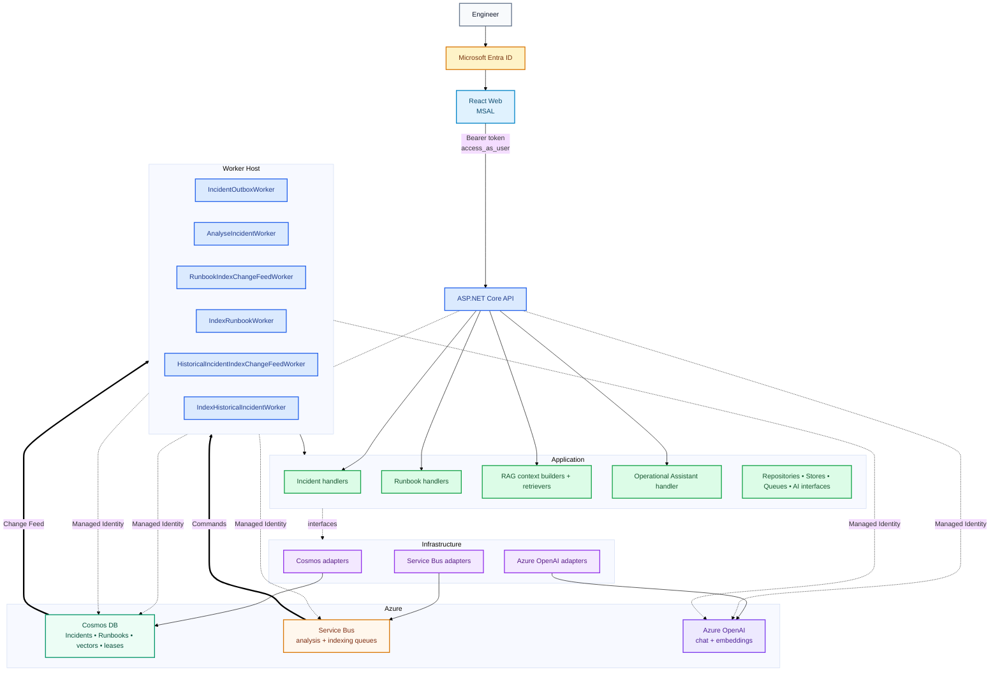

# IncidentIQ Architecture

## Component View



## Boundaries

- **Domain:** business entities and state rules.
- **Application:** use cases, orchestration and provider-independent interfaces.
- **Infrastructure:** Cosmos, Service Bus and Azure OpenAI implementations.
- **API:** HTTP, authentication/authorization and DTO boundary.
- **Worker:** Change Feed relays and Service Bus consumers.
- **Web:** authenticated engineer/admin UI.

## Identity & Authorization

```text
User → Entra → React/MSAL → Bearer token → API
API / Worker → Managed Identity → Azure resources
```

- All controller endpoints require an authenticated token with `access_as_user`.
- Normal Incident, Runbook and Assistant functionality requires `Engineer` or `Administrator`.
- Operations and Incident retry require `Administrator`.
- `/api/me` exposes the authenticated user's roles to the UI; backend policies remain the security boundary.
- `/api/health` remains anonymous.
- User tokens are never forwarded to Cosmos, Service Bus or Azure OpenAI.

## Asynchronous Analysis

```text
POST /api/incidents
→ Incident + outbox in one Cosmos transactional batch
→ Cosmos Change Feed
→ Service Bus analyse-incident
→ AnalyseIncidentWorker
→ retrieve historical Incidents + Runbook chunks
→ Azure OpenAI
→ completed Incident + analysis/evidence
```

The W3C trace context is persisted with the outbox command so API and Worker activity can participate in the same distributed trace.

## Data

| Container | Partition key | Purpose |
| --- | --- | --- |
| `Incidents` | `/incidentId` | Incident, outbox, analysis/evidence |
| `Runbooks` | `/id` | Editable Runbooks |
| `RunbookChunks` | `/runbookId` | Derived Runbook vectors |
| `HistoricalIncidentVectors` | `/incidentId` | Derived completed-Incident vectors |
| `ChangeFeedLeases` | `/id` | Change Feed checkpoints |

Source records and rebuildable vector indexes remain separate.

## Observability & Scaling

- API and Worker emit OpenTelemetry to one Application Insights resource with role names `IncidentIQ.Api` and `IncidentIQ.Worker`.
- Custom spans cover outbox relay, analysis, retrieval, AI generation and persistence.
- Custom metrics cover queue wait, processing duration, AI duration, terminal failures and administrator retries.
- The Worker Container App uses KEDA against the `analyse-incident` Service Bus queue.
- Scaling is configured for **1–3 replicas**, with a target of **2 queued analysis messages per replica** and a 15-second polling interval.
- Minimum replicas remains 1 because the same Worker host also owns Cosmos Change Feed relays.

See [Observability & Scaling](OBSERVABILITY.md) and [Runtime Flows](flows/README.md).
