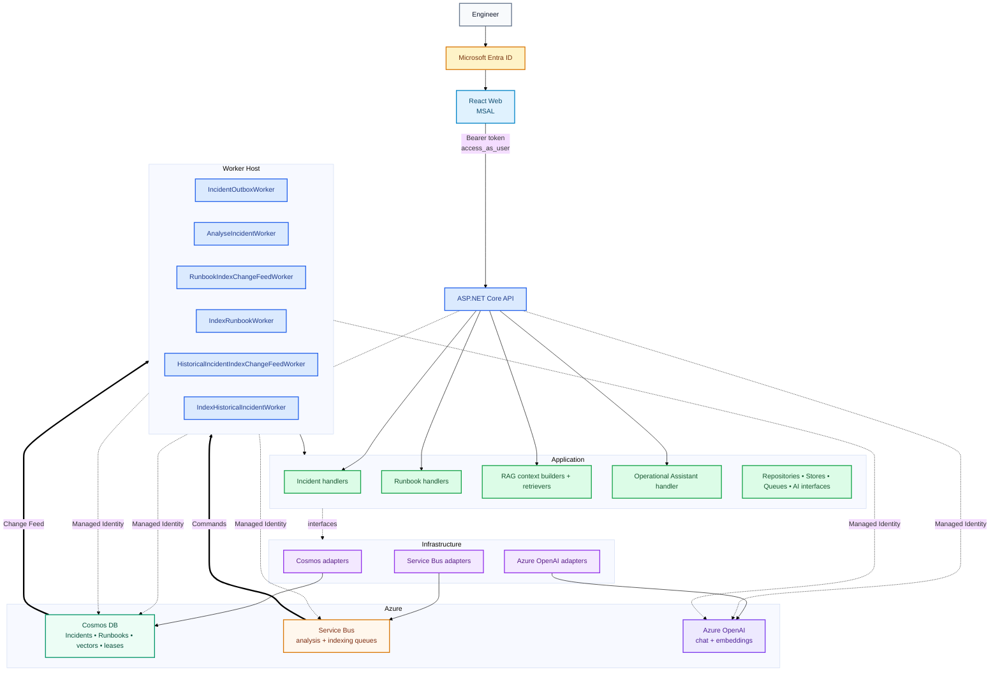

# IncidentIQ Architecture

## Component View



## Boundaries

- **Domain:** business entities and state rules.
- **Application:** use cases, orchestration and provider-independent interfaces.
- **Infrastructure:** Cosmos, Service Bus and Azure OpenAI implementations.
- **API:** HTTP/authentication boundary.
- **Worker:** Change Feed and Service Bus execution boundary.
- **Web:** authenticated engineer UI.

## Identity

```text
User → Entra → React/MSAL → Bearer token → API
API / Worker → Managed Identity → Azure resources
```

- Controller endpoints require authentication and `access_as_user`.
- `/api/health` remains anonymous.
- User tokens are not forwarded to Cosmos, Service Bus or Azure OpenAI.
- Engineer/Administrator role policies are Stage 14C.

## Data

| Container | Partition key | Purpose |
| --- | --- | --- |
| `Incidents` | `/incidentId` | Incident, outbox, analysis/evidence |
| `Runbooks` | `/id` | Editable Runbooks |
| `RunbookChunks` | `/runbookId` | Derived Runbook vectors |
| `HistoricalIncidentVectors` | `/incidentId` | Derived completed-Incident vectors |
| `ChangeFeedLeases` | `/id` | Change Feed checkpoints |

Source records and rebuildable vector indexes remain separate.

See [Runtime Flows](flows/README.md) for request-by-request diagrams.
