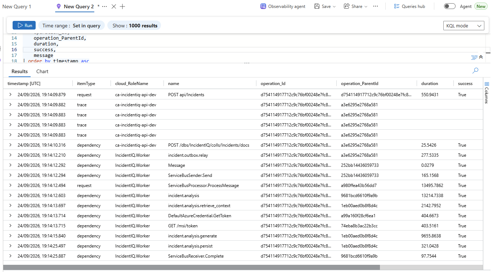
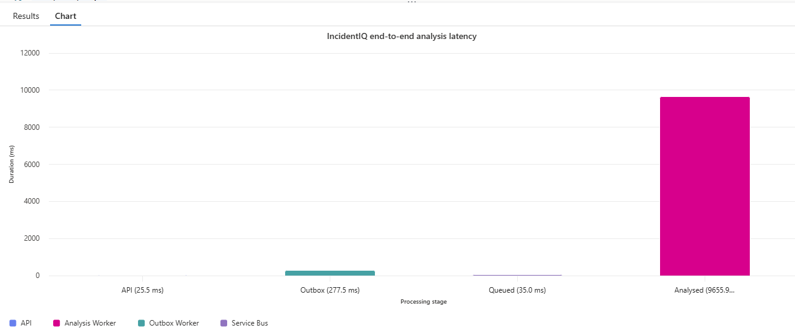
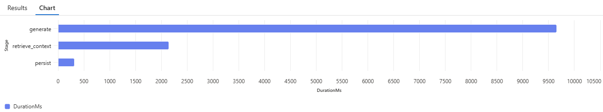

# Observability & Scaling

IncidentIQ uses OpenTelemetry with Azure Monitor/Application Insights for distributed traces and custom metrics. The product Operations page intentionally exposes only application state; deep diagnostics stay in Azure Monitor.

## Telemetry Roles

| Process | Application Insights role |
| --- | --- |
| ASP.NET Core API | `IncidentIQ.Api` |
| .NET Worker | `IncidentIQ.Worker` |

Custom source names:

```text
ActivitySource: IncidentIQ
Meter:          IncidentIQ
```

## Distributed Trace

Incident submission crosses a Cosmos outbox boundary, so IncidentIQ explicitly persists W3C `traceparent`/`tracestate` with `AnalyseIncidentCommand`.

```text
POST /api/incidents
→ Cosmos Incident + outbox
→ incident.outbox.relay
→ Service Bus
→ incident.analysis
   ├── incident.analysis.retrieve_context
   ├── incident.analysis.generate
   └── incident.analysis.persist
```

The application correlation ID is also retained for logging/search, but the W3C context is what preserves parent/child trace relationships.

### OpenTelemetry Trace Example

The trace below shows a real IncidentIQ request correlated across the API, Cosmos outbox relay, Azure Service Bus, and the analysis Worker.



### Incident Analysis Stages

Custom spans make the major analysis stages visible independently, including context retrieval, AI generation, and persistence.



### End-to-End Analysis Timing

The latency view makes it easier to see where time is spent across the asynchronous flow, from the API and outbox through Service Bus and the analysis Worker.



## Custom Metrics

| Metric | Type | Purpose |
| --- | --- | --- |
| `incident.analysis.queue_wait.duration` | Histogram (ms) | queued → Worker processing start |
| `incident.analysis.processing.duration` | Histogram (ms) | Worker processing duration |
| `incident.analysis.ai.duration` | Histogram (ms) | AI generation duration |
| `incident.analysis.failures` | Counter | terminal failures after delivery attempts are exhausted |
| `incident.analysis.retries` | Counter | successful administrator-triggered retries |

High-cardinality values such as Incident IDs are kept on traces/logs rather than metric dimensions.

## Useful KQL

### Find a complete workflow

```kusto
let correlationId = "<TRACE-OR-CORRELATION-ID>";
union withsource=TableName AppRequests, AppDependencies, AppTraces, AppExceptions
| where TimeGenerated > ago(1h)
| where OperationId == correlationId
    or tostring(Properties["CorrelationId"]) == correlationId
| project TimeGenerated, TableName, AppRoleName, Name, OperationId, ParentId, DurationMs, Success, Message, Properties
| order by TimeGenerated asc
```

### Average queue wait

```kusto
AppMetrics
| where TimeGenerated > ago(24h)
| where Name == "incident.analysis.queue_wait.duration"
| summarize AverageQueueWaitMs = sum(Sum) / sum(ItemCount)
```

### Processing latency

```kusto
AppDependencies
| where TimeGenerated > ago(24h)
| where AppRoleName == "IncidentIQ.Worker"
| where Name == "incident.analysis"
| summarize AverageMs = avg(DurationMs), P95Ms = percentile(DurationMs, 95)
```

### AI latency

```kusto
AppDependencies
| where TimeGenerated > ago(24h)
| where AppRoleName == "IncidentIQ.Worker"
| where Name == "incident.analysis.generate"
| summarize AverageMs = avg(DurationMs), P95Ms = percentile(DurationMs, 95)
```

### Failures and administrator retries

```kusto
AppMetrics
| where TimeGenerated > ago(24h)
| where Name in ("incident.analysis.failures", "incident.analysis.retries")
| summarize Total = sum(Sum) by Name
```

## Operations Page

Administrator-only `/operations` provides:

```text
Total | Queued | Processing | Completed | Failed
```

and a failed-Incident table with retry controls. It does not query Application Insights or expose KEDA internals; Azure Monitor remains the source for detailed telemetry.

## KEDA Scaling

The Worker Container App scales from the `analyse-incident` Service Bus queue:

```text
min replicas:       1
max replicas:       3
polling interval:   15 seconds
target queue depth: 2 messages per replica
```

The Worker identity has Service Bus send/receive access and queue-scoped Data Owner access for the KEDA scaler.

`minReplicas` stays at 1 because the same host also runs Cosmos Change Feed processors. Scale-to-zero would stop those relays, leaving no process available to create the Service Bus backlog that should wake the Worker.

## Stage 16 Azure Verification

1. Deploy the observability/scaling branch.
2. Submit a normal Incident and confirm API + Worker spans share one `OperationId`.
3. Confirm queue-wait, processing and AI-duration telemetry appears.
4. Exercise a terminal failure and confirm `incident.analysis.failures` increments.
5. Retry a failed Incident as Administrator and confirm the retry counter and new trace.
6. Create a controlled analysis backlog large enough to move the Worker above one replica.
7. Confirm processing remains correct across multiple replicas and the app scales back to one after the queue drains.
