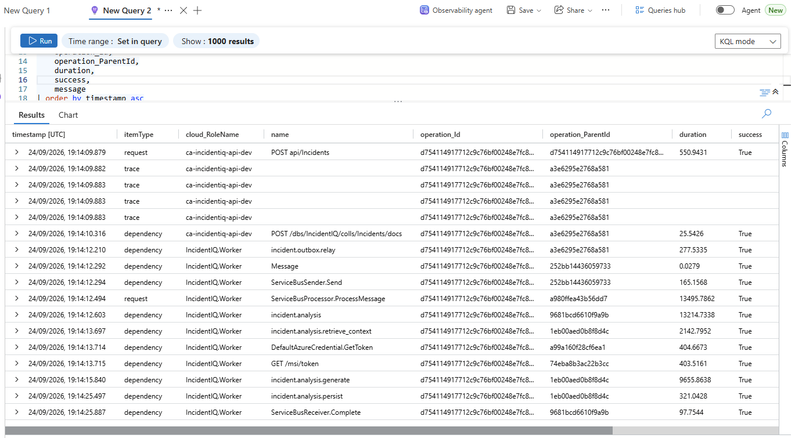
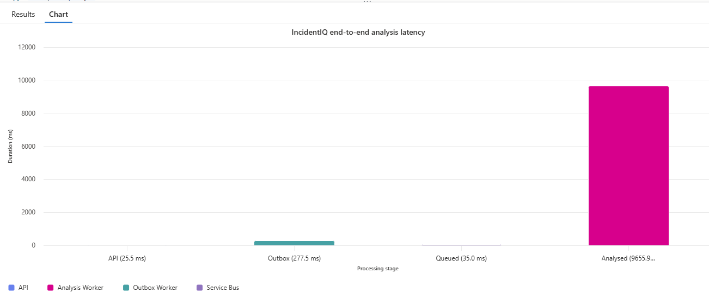
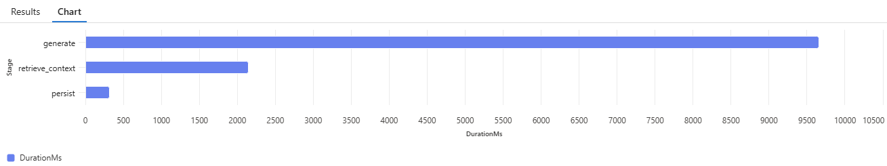

# Observability & Scaling

IncidentIQ uses OpenTelemetry with Azure Monitor/Application Insights for distributed traces and custom metrics. The product Operations page intentionally exposes application state only; deep diagnostics stay in Azure Monitor.

## Telemetry Identity

| Process | OpenTelemetry service / Application Insights role |
| --- | --- |
| ASP.NET Core API | configured as `IncidentIQ.Api`; Container Apps resource-context views may surface the Container App role name |
| .NET Worker | `IncidentIQ.Worker` |

Custom source names:

```text
ActivitySource: IncidentIQ
Meter:          IncidentIQ
```

## Distributed Trace

Incident submission crosses a Cosmos outbox boundary, so IncidentIQ explicitly persists W3C `traceparent`/`tracestate` with `AnalyseIncidentCommand`.

```text
POST /api/incidents
→ Cosmos Incident + outbox
→ incident.outbox.relay
→ Service Bus
→ incident.analysis
   ├── incident.analysis.retrieve_context
   ├── incident.analysis.generate
   └── incident.analysis.persist
```

The application correlation ID is retained for logging/search, while W3C context preserves the parent/child trace relationship across the asynchronous boundary.

### OpenTelemetry Trace Example

The trace below is from a real Azure run and shows one operation correlated across the API, Cosmos outbox relay, Service Bus and analysis Worker.



### Incident Analysis Stages

Custom spans make context retrieval, AI generation and persistence independently visible.



### End-to-End Analysis Timing

The latency view shows where time is spent across the API/outbox/queue/Worker flow.



## Custom Metrics

| Metric | Type | Purpose |
| --- | --- | --- |
| `incident.analysis.queue_wait.duration` | Histogram (ms) | command queued → Worker processing start |
| `incident.analysis.processing.duration` | Histogram (ms) | total Worker processing duration |
| `incident.analysis.ai.duration` | Histogram (ms) | AI generation duration |
| `incident.analysis.failures` | Counter | terminal failures after delivery attempts are exhausted |
| `incident.analysis.retries` | Counter | administrator-triggered retries |

High-cardinality values such as Incident IDs stay on traces/logs rather than metric dimensions.

Azure Monitor aggregates histogram measurements, so use `valueSum / valueCount` for averages rather than treating one `customMetrics` row as one request.

## Useful KQL

The queries below use the **Application Insights resource-context schema** verified during Azure testing (`requests`, `dependencies`, `traces`, `exceptions`, `customMetrics`). Workspace-context Logs may expose the equivalent `AppRequests`, `AppDependencies`, `AppTraces`, `AppExceptions` and `AppMetrics` tables instead.

### Find a complete workflow

```kusto
union requests, dependencies, traces, exceptions
| where timestamp > ago(1h)
| where operation_Id == "<OPERATION-ID>"
| project timestamp, itemType, cloud_RoleName, name, operation_Id, operation_ParentId, duration, success, message
| order by timestamp asc
```

### Average queue wait

```kusto
customMetrics
| where timestamp > ago(24h)
| where name == "incident.analysis.queue_wait.duration"
| summarize Samples = sum(valueCount), AverageQueueWaitMs = sum(valueSum) / sum(valueCount)
```

### Processing latency

```kusto
dependencies
| where timestamp > ago(24h)
| where name == "incident.analysis"
| summarize AverageMs = avg(duration), P95Ms = percentile(duration, 95)
```

### AI latency

```kusto
dependencies
| where timestamp > ago(24h)
| where name == "incident.analysis.generate"
| summarize AverageMs = avg(duration), P95Ms = percentile(duration, 95)
```

### Custom metric health

```kusto
customMetrics
| where timestamp > ago(24h)
| where name startswith "incident.analysis"
| summarize Measurements = sum(valueCount), Total = sum(valueSum), Average = sum(valueSum) / sum(valueCount) by name, cloud_RoleName
| order by name asc
```

### Failures and administrator retries

```kusto
customMetrics
| where timestamp > ago(24h)
| where name in ("incident.analysis.failures", "incident.analysis.retries")
| summarize Total = sum(valueSum) by name
```

## Operations Page

Administrator-only `/operations` provides:

```text
Total | Queued | Processing | Completed | Failed
```

It also lists failed Incidents with retry controls. It does not query Application Insights or expose KEDA internals; Azure Monitor remains the source for detailed telemetry.

## KEDA Scaling

The Worker Container App scales from the `analyse-incident` Service Bus queue:

```text
min replicas:       1
max replicas:       3
polling interval:   15 seconds
target queue depth: 2 messages per replica
```

The Worker identity has Service Bus sender/receiver access and queue-scoped Data Owner access required by the KEDA scaler.

`minReplicas` stays at 1 because the same host also runs Cosmos Change Feed processors. Scale-to-zero would stop those relays, leaving no process available to create the Service Bus backlog that should wake the Worker.

## Azure Verification

Stage 16 was verified against the deployed Azure environment:

- API and Worker telemetry was correlated under one `operation_Id` across the Cosmos outbox and Service Bus boundary.
- semantic analysis spans appeared for retrieval, AI generation and persistence.
- queue-wait, processing and AI-duration metrics were exported successfully.
- terminal failure and administrator retry counters were exercised.
- a controlled backlog caused KEDA scale-out above one Worker replica.
- the Worker returned to its minimum replica count after the queue drained.
