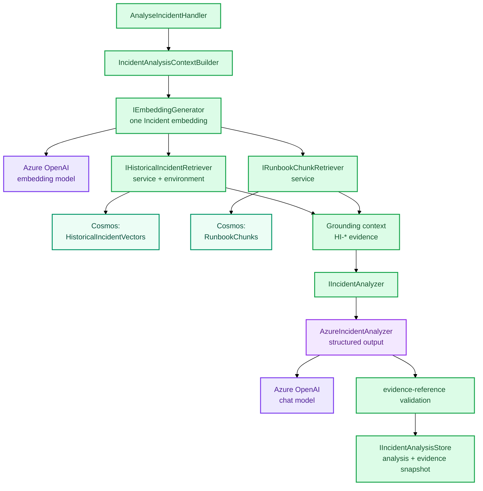

# Grounded Incident Analysis

Grounded analysis combines two different evidence sources before asking Azure OpenAI to generate the Incident analysis.

## At a glance

```text
Incident
→ one embedding
→ retrieve similar historical Incidents ─┐
                                          ├─→ combined context
→ retrieve relevant Runbook chunks ──────┘
                                          ↓
                                AzureIncidentAnalyzer
                                          ↓
                            structured grounded analysis
                                          ↓
                           validate HI-* / RB-* references
                                          ↓
                      persist analysis + evidence snapshot
```

## Flow



## Why two evidence types stay separate

Historical Incidents and Runbooks answer different questions:

- `HI-*` evidence says **what happened before** in similar Incidents.
- `RB-*` evidence says **what the organisation recommends doing**.

Keeping those sources distinct helps the model and the engineer avoid treating a Runbook as proof of a cause or a historical Incident as guaranteed repetition.

## Structured output and validation

`AzureIncidentAnalysisSchema` constrains the JSON shape produced by Azure OpenAI. After deserialisation, application-level validation checks semantic rules that a static schema cannot know in advance, especially whether returned `HI-*` and `RB-*` identifiers were actually present in this request's grounding context.

The completed analysis persists evidence snapshots alongside the result. That means the UI can show the evidence used at analysis time even if the vector index later changes.

See [RAG & AI Design](../RAG-AND-AI.md) for the shared AI rules.
