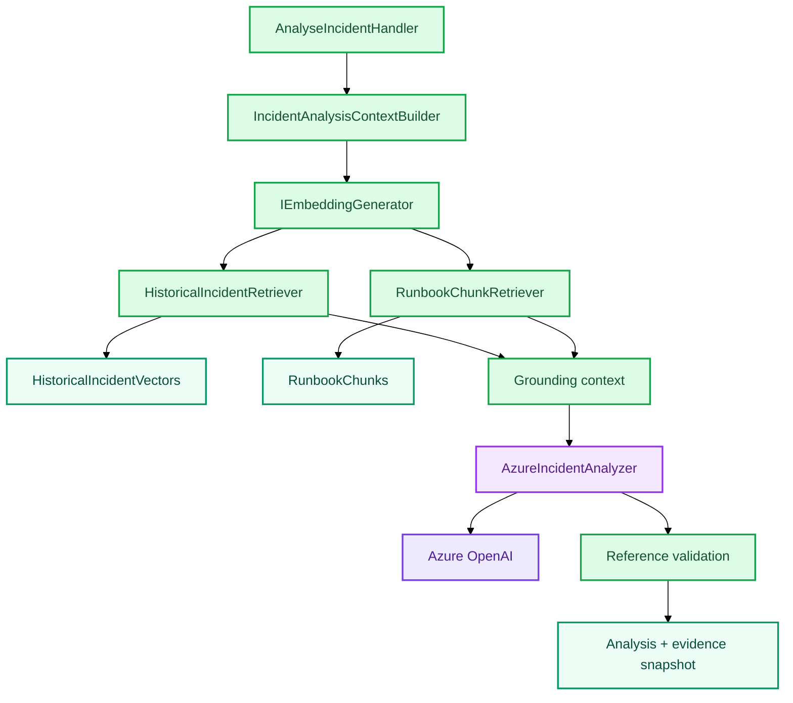

# Grounded Incident Analysis

```text
Incident
→ one embedding
→ historical Incident retrieval ─┐
                                 ├→ grounding context
→ Runbook retrieval ─────────────┘
→ AzureIncidentAnalyzer
→ structured result
→ validate HI-* / RB-*
→ persist result + evidence snapshot
```



`HI-*` represents similar previous observations; `RB-*` represents operational guidance. Keeping them distinct avoids treating either as proof of the current cause.
