# Historical Incident Indexing

```text
Completed Incident
→ Incidents Change Feed
→ HistoricalIncidentIndexChangeFeedWorker
→ Service Bus: index-historical-incident
→ IndexHistoricalIncidentWorker
→ IndexHistoricalIncidentHandler
→ embed title + description + symptoms
→ HistoricalIncidentVectors
```

```mermaid
%%{init: {"theme":"base","themeVariables":{"background":"#ffffff"}} }%%
flowchart LR
    Incidents["Cosmos: Incidents"]:::data ==>|Change Feed| Relay["HistoricalIncidentIndexChangeFeedWorker"]:::host
    Relay ==>|IndexHistoricalIncidentCommand| Bus["Service Bus"]:::msg
    Bus --> Worker["IndexHistoricalIncidentWorker"]:::host
    Worker --> Handler["IndexHistoricalIncidentHandler"]:::app
    Handler --> AI["Azure OpenAI embeddings"]:::ai
    Handler --> Vectors["HistoricalIncidentVectors"]:::data

    classDef host fill:#dbeafe,stroke:#2563eb,color:#1e3a8a,stroke-width:2px;
    classDef app fill:#dcfce7,stroke:#16a34a,color:#14532d,stroke-width:2px;
    classDef data fill:#ecfdf5,stroke:#059669,color:#064e3b,stroke-width:2px;
    classDef msg fill:#fff7ed,stroke:#d97706,color:#7c2d12,stroke-width:2px;
    classDef ai fill:#ede9fe,stroke:#7c3aed,color:#4c1d95,stroke-width:2px;
```



The previous AI analysis is not embedded; the vector represents the original operational report.
