# Historical Incident Indexing

Completed Incidents are converted into a compact searchable vector representation so future analysis can retrieve similar operational history.

## At a glance

```text
Incident reaches Completed
→ Incidents Change Feed
→ HistoricalIncidentIndexChangeFeedWorker
→ index-historical-incident
→ IndexHistoricalIncidentWorker
→ IndexHistoricalIncidentHandler
→ embed Incident text
→ HistoricalIncidentVectors
```

## Flow

```mermaid
%%{init: {"theme":"base","themeVariables":{"background":"#ffffff"}} }%%
flowchart LR
    Incidents["Cosmos: Incidents<br/>completed Incident"]:::data
    Incidents ==>|"Change Feed"| Relay["HistoricalIncidentIndexChangeFeedWorker"]:::host
    Relay --> QueuePort["Historical Incident index queue abstraction"]:::app
    QueuePort ==>|"IndexHistoricalIncidentCommand"| Queue["Service Bus<br/>index-historical-incident"]:::msg
    Queue ==>|"message"| Worker["IndexHistoricalIncidentWorker"]:::host
    Worker --> Handler["IndexHistoricalIncidentHandler"]:::app

    Handler --> Repo["IIncidentRepository"]:::app
    Repo --> Incidents
    Handler --> Embed["IEmbeddingGenerator"]:::app
    Embed --> AI["Azure OpenAI<br/>embeddings"]:::ai
    Handler --> Store["IHistoricalIncidentVectorStore"]:::app
    Store --> Vectors["Cosmos: HistoricalIncidentVectors<br/>derived vectors"]:::data

    classDef host fill:#dbeafe,stroke:#2563eb,color:#1e3a8a,stroke-width:2px;
    classDef app fill:#dcfce7,stroke:#16a34a,color:#14532d,stroke-width:2px;
    classDef data fill:#ecfdf5,stroke:#059669,color:#064e3b,stroke-width:2px;
    classDef msg fill:#fff7ed,stroke:#d97706,color:#7c2d12,stroke-width:2px;
    classDef ai fill:#ede9fe,stroke:#7c3aed,color:#4c1d95,stroke-width:2px;
```



## What is embedded

The historical vector is based on the Incident's operational description:

```text
Title
Description
Symptoms
```

The previous AI analysis is deliberately not embedded. The vector should represent the original Incident, not an earlier model's interpretation of it.

The derived document keeps useful metadata such as service, environment, severity and completion time so retrieval can combine semantic similarity with metadata filtering.
