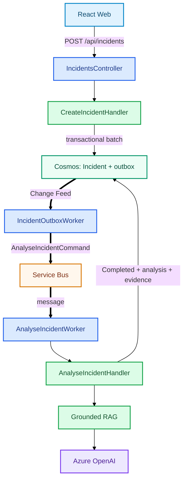

# Incident Submission and Analysis

```text
React
→ Bearer-authenticated POST /api/incidents
→ CreateIncidentHandler
→ Cosmos transactional batch: Incident + outbox

async

Change Feed
→ IncidentOutboxWorker
→ Service Bus: analyse-incident
→ AnalyseIncidentWorker
→ AnalyseIncidentHandler
→ grounded RAG analysis
→ Completed Incident + analysis/evidence
```



The transactional outbox removes the Cosmos/Service Bus dual-write gap. Service Bus then provides durable buffering, retries and DLQ behavior.
