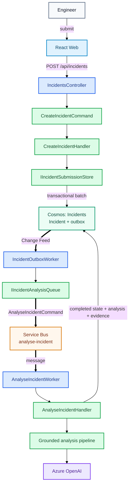

# Incident Submission and Asynchronous Analysis

This is the main write path in IncidentIQ. The HTTP request creates durable work; the expensive AI analysis runs later in the Worker.

## At a glance

```text
React
→ POST /api/incidents
→ IncidentsController
→ CreateIncidentCommand
→ CreateIncidentHandler
→ Incident + outbox written atomically to Cosmos

                async boundary

Cosmos Change Feed
→ IncidentOutboxWorker
→ analyse-incident
→ AnalyseIncidentWorker
→ AnalyseIncidentHandler
→ grounded RAG analysis
→ completed Incident + analysis persisted
```

## Flow



## Why the asynchronous split exists

The API does not wait for embeddings, retrieval or an LLM call. It only needs to durably create the Incident and its `AnalyseIncidentCommand` outbox record.

The transactional outbox prevents the classic dual-write failure where the Incident is stored successfully but publishing to Service Bus fails. Change Feed later relays the durable command to `analyse-incident`.

`AnalyseIncidentWorker` is a transport boundary, not the business workflow itself. It resolves `AnalyseIncidentHandler`, which coordinates state changes, retrieval, AI generation and persistence through Application interfaces.

For the RAG-specific part of the handler, see [Grounded Incident Analysis](grounded-incident-analysis.md).
