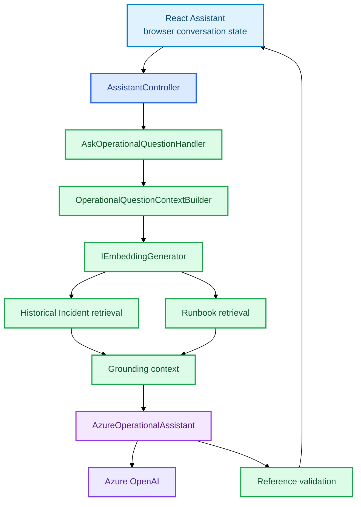

# Operational Assistant

```text
React
→ authenticated POST /api/assistant/questions
→ AskOperationalQuestionHandler
→ embed current question
→ retrieve historical Incidents + Runbook chunks
→ AzureOperationalAssistant
→ structured answer + HI-* / RB-*
→ validate references
→ return answer + exact evidence
```



The current question drives retrieval. Recent conversation turns provide continuity only and are not grounding evidence. Evidence identifiers are scoped to the response that returned them.
