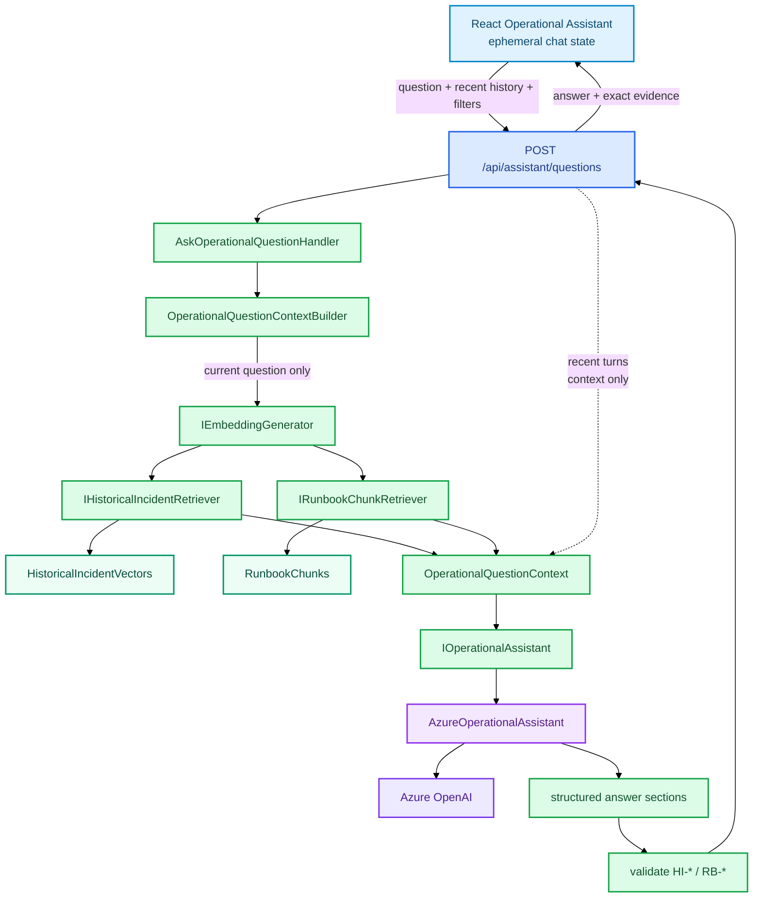

# Operational Assistant

The Operational Assistant is a stateless backend conversation over fresh RAG retrieval. React owns the temporary conversation for the current browser session.

## At a glance

```text
React /assistant
→ POST /api/assistant/questions
→ AskOperationalQuestionHandler
→ OperationalQuestionContextBuilder
→ embed current question
→ retrieve historical Incidents + Runbook chunks
→ AzureOperationalAssistant
→ structured answer sections + HI-* / RB-* references
→ validate references
→ return answer + exact evidence to React
```

## Flow



## Conversation versus evidence

The current question drives semantic retrieval. Recent user/Assistant turns are sent to the model so a follow-up such as *"what should I check first?"* still makes sense, but previous turns are not treated as evidence and cannot be cited.

The backend does not persist conversations yet. React sends the recent conversation history with each request. Persistence is intentionally deferred until authenticated user identity is available.

## Answer-scoped evidence

`HI-1` and `RB-1` are request-scoped identifiers. `HI-1` in one answer may refer to a different source than `HI-1` in a later answer.

The API therefore returns the evidence together with each answer. The React evidence inspector resolves a citation against the specific Assistant response that produced it, rather than against a global source list.

`AzureOperationalAssistantSchema` constrains the response shape, while application validation confirms that every cited reference was actually supplied for the current answer.
