# Runbook Indexing

Runbooks are editable source documents. Their vector chunks are derived search data and are rebuilt asynchronously whenever the source changes.

## At a glance

```text
Runbook create/update
→ Runbooks container
→ Change Feed
→ RunbookIndexChangeFeedWorker
→ index-runbook
→ IndexRunbookWorker
→ IndexRunbookHandler
→ chunk
→ embed
→ replace RunbookChunks
```

## Flow

```mermaid
%%{init: {"theme":"base","themeVariables":{"background":"#ffffff"}} }%%
flowchart LR
    Web["React Runbooks"]:::web -->|"create / update"| API["RunbooksController"]:::host
    API --> Handler["Runbook handler"]:::app
    Handler --> Repo["IRunbookRepository"]:::app
    Repo --> Runbooks["Cosmos: Runbooks<br/>source of truth"]:::data

    Runbooks ==>|"Change Feed"| Relay["RunbookIndexChangeFeedWorker"]:::host
    Relay --> QueuePort["IRunbookIndexQueue"]:::app
    QueuePort ==>|"IndexRunbookCommand"| Queue["Service Bus<br/>index-runbook"]:::msg
    Queue ==>|"message"| Worker["IndexRunbookWorker"]:::host
    Worker --> Index["IndexRunbookHandler"]:::app

    Index -->|"load latest"| Repo
    Index --> Chunker["RunbookChunker"]:::app
    Chunker --> Embed["IEmbeddingGenerator"]:::app
    Embed --> AI["Azure OpenAI<br/>embeddings"]:::ai
    Index --> Store["IRunbookChunkStore"]:::app
    Store --> Chunks["Cosmos: RunbookChunks<br/>derived vectors"]:::data

    classDef web fill:#e0f2fe,stroke:#0284c7,color:#0c4a6e,stroke-width:2px;
    classDef host fill:#dbeafe,stroke:#2563eb,color:#1e3a8a,stroke-width:2px;
    classDef app fill:#dcfce7,stroke:#16a34a,color:#14532d,stroke-width:2px;
    classDef data fill:#ecfdf5,stroke:#059669,color:#064e3b,stroke-width:2px;
    classDef msg fill:#fff7ed,stroke:#d97706,color:#7c2d12,stroke-width:2px;
    classDef ai fill:#ede9fe,stroke:#7c3aed,color:#4c1d95,stroke-width:2px;
```



## Source versus derived data

`Runbooks` is the editable source of truth. `RunbookChunks` contains deterministic chunks plus embeddings for retrieval.

That separation keeps vector/indexing concerns out of the source repository. Re-indexing replaces the current derived chunks for a Runbook, and deleting a Runbook removes its derived chunks before deleting the source document.

A failed indexing job does not corrupt the source Runbook; Service Bus can redeliver the indexing command.
