# Runbook Indexing

```text
Runbook create/update
→ Cosmos Runbooks
→ Change Feed
→ RunbookIndexChangeFeedWorker
→ Service Bus: index-runbook
→ IndexRunbookWorker
→ IndexRunbookHandler
→ chunk + embed
→ replace RunbookChunks
```

```mermaid
%%{init: {"theme":"base","themeVariables":{"background":"#ffffff"}} }%%
flowchart LR
    Web["React"]:::web --> API["RunbooksController"]:::host
    API --> Runbooks["Cosmos: Runbooks"]:::data
    Runbooks ==>|Change Feed| Relay["RunbookIndexChangeFeedWorker"]:::host
    Relay ==>|IndexRunbookCommand| Bus["Service Bus"]:::msg
    Bus --> Worker["IndexRunbookWorker"]:::host
    Worker --> Index["IndexRunbookHandler"]:::app
    Index --> Embed["IEmbeddingGenerator"]:::app
    Embed --> AI["Azure OpenAI"]:::ai
    Index --> Chunks["Cosmos: RunbookChunks"]:::data

    classDef web fill:#e0f2fe,stroke:#0284c7,color:#0c4a6e,stroke-width:2px;
    classDef host fill:#dbeafe,stroke:#2563eb,color:#1e3a8a,stroke-width:2px;
    classDef app fill:#dcfce7,stroke:#16a34a,color:#14532d,stroke-width:2px;
    classDef data fill:#ecfdf5,stroke:#059669,color:#064e3b,stroke-width:2px;
    classDef msg fill:#fff7ed,stroke:#d97706,color:#7c2d12,stroke-width:2px;
    classDef ai fill:#ede9fe,stroke:#7c3aed,color:#4c1d95,stroke-width:2px;
```



`Runbooks` is source data; `RunbookChunks` is rebuildable retrieval data. Indexing failures do not corrupt the source Runbook.
