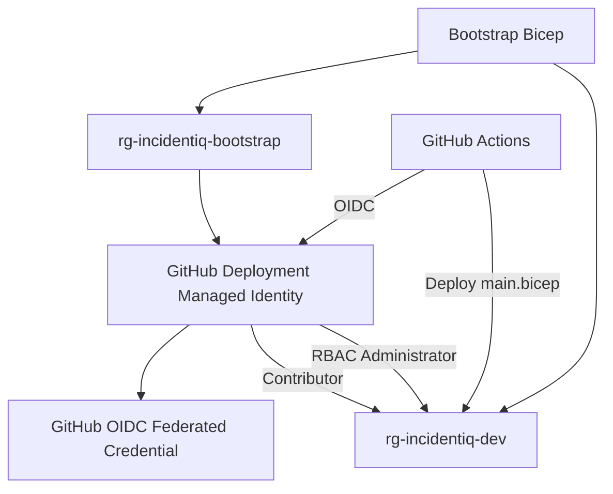
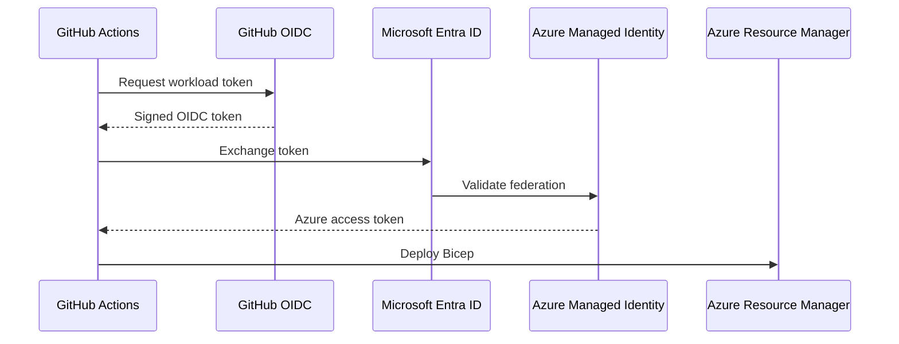
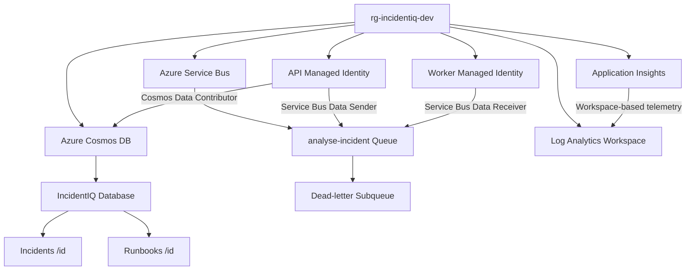
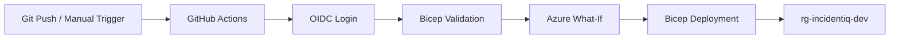
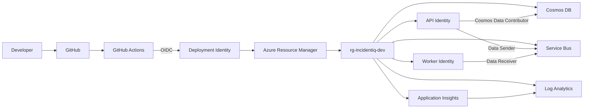

# IncidentIQ Infrastructure

This folder contains the **Infrastructure as Code (IaC)** for IncidentIQ.

Azure resources are defined using **Bicep** and deployed through **GitHub Actions** using **OIDC authentication**. The goal is to keep the development environment reproducible, version-controlled, and easy to recreate without manually configuring resources in the Azure Portal.

**For instructions on deleting/recreating the development environment and refreshing local configuration, see**:

```text
docs/INCIDENTIQ-AZURE-DEV-LIFECYCLE.md
```

---

## Overview

The infrastructure is split into two areas:

- **Bootstrap infrastructure** — creates the Azure deployment foundation used by GitHub Actions.
- **Environment infrastructure** — creates the Azure resources used by IncidentIQ itself.



The bootstrap identity is deliberately kept outside `rg-incidentiq-dev`, allowing the development resource group to be deleted and recreated without breaking GitHub authentication.

---

## Folder Structure

```text
infra/
├── bootstrap/
│   ├── main.bicep
│   ├── github-identity.bicep
│   └── deployment-role.bicep
│
├── environments/
│   └── dev.bicepparam
│
├── local/
│   └── servicebus/
│       └── Config.json
│
├── modules/
│   ├── api-identity.bicep
│   ├── application-insights.bicep
│   ├── cosmos.bicep
│   ├── log-analytics.bicep
│   ├── service-bus.bicep
│   └── worker-identity.bicep
│
├── main.bicep
└── README.md
```

---

# Bootstrap Infrastructure

The bootstrap deployment is used when the Azure deployment foundation needs to be created, recreated, or changed.

It runs at **subscription scope** because it creates resource groups.

## `bootstrap/main.bicep`

Creates:

- `rg-incidentiq-bootstrap`
- `rg-incidentiq-dev`
- GitHub deployment managed identity
- GitHub OIDC federated credential
- deployment RBAC assignments on `rg-incidentiq-dev`

The deployment identity remains in `rg-incidentiq-bootstrap`, so deleting `rg-incidentiq-dev` does not delete the identity GitHub uses to deploy it.

---

## `bootstrap/github-identity.bicep`

Creates the user-assigned managed identity used by GitHub Actions.

Example:

```text
id-incidentiq-github-dev
```

It also creates the federated identity credential used by the GitHub `development` environment.



No Azure client secret is stored in GitHub.

The GitHub `development` environment contains only:

```text
AZURE_CLIENT_ID
AZURE_TENANT_ID
AZURE_SUBSCRIPTION_ID
```

---

## `bootstrap/deployment-role.bicep`

Grants the GitHub deployment identity permissions on:

```text
rg-incidentiq-dev
```

Current roles:

```text
Contributor
└── create and update application infrastructure

Role Based Access Control Administrator
└── create workload RBAC assignments
```

Both roles are scoped to the **development resource group**, rather than the subscription.

This allows the infrastructure pipeline to create assignments such as:

```text
API identity
└── Service Bus Data Sender

Worker identity
└── Service Bus Data Receiver
```

without granting the deployment identity subscription-wide RBAC control.

---

# Environment Infrastructure

`main.bicep` is the composition root for the actual IncidentIQ Azure environment.

Environment-specific values are supplied through:

```text
environments/dev.bicepparam
```

The current environment is:

```text
Resource group: rg-incidentiq-dev
Region:         UK South
Environment:    dev
```

---

# Current Azure Resources

The current development environment contains:



At this stage, the Worker identity's Service Bus access is provisioned. Any additional Azure-hosted Worker permissions, such as Cosmos access, should be added through Bicep before the Worker Container App is deployed.

---

## Cosmos DB

Defined in:

```text
modules/cosmos.bicep
```

Creates:

- Azure Cosmos DB for NoSQL account
- `IncidentIQ` database
- `Incidents` container
- `Runbooks` container
- `/id` partition key for both containers
- Cosmos indexing configuration
- Cosmos RBAC for the API managed identity

The development account uses the **Serverless** capability to keep development usage lightweight.

```text
Cosmos Account
└── IncidentIQ
    ├── Incidents
    │   └── Partition Key: /id
    │
    └── Runbooks
        └── Partition Key: /id
```

Future AI stages will add dedicated vector/chunk persistence rather than storing embeddings directly on editable Runbook documents.

---

## Service Bus

Defined in:

```text
modules/service-bus.bicep
```

Creates the Azure Service Bus namespace and the queue used to request asynchronous incident analysis:

```text
Service Bus Namespace
└── analyse-incident
    └── $DeadLetterQueue
```

The queue is configured with development-friendly reliability settings including:

- explicit message lock duration
- maximum delivery count
- dead-lettering on message expiration
- duplicate detection
- message TTL

`AnalyseIncident` is treated as a **command**, so it uses a queue with one logical consumer: the IncidentIQ Worker.

Completion events such as `AnalysisCompleted` and `AnalysisFailed` are planned for Event Grid rather than Service Bus topics.

---

## API Managed Identity

Defined in:

```text
modules/api-identity.bicep
```

Creates:

```text
id-incidentiq-api-dev
```

The identity is intended to be attached to the API Container App when application deployment is introduced.

Current permissions include:

```text
Azure Cosmos DB
└── Cosmos DB Built-in Data Contributor

analyse-incident
└── Azure Service Bus Data Sender
```

This allows the Azure-hosted API to use `DefaultAzureCredential` instead of storing Cosmos or Service Bus credentials.

---

## Worker Managed Identity

Defined in:

```text
modules/worker-identity.bicep
```

Creates:

```text
id-incidentiq-worker-dev
```

The identity is intended to be attached to the Worker Container App.

Current Service Bus permission:

```text
analyse-incident
└── Azure Service Bus Data Receiver
```

This allows the Worker to consume `AnalyseIncident` commands using Managed Identity once deployed to Azure.

Additional workload permissions will be added through Bicep as the Azure-hosted Worker requires them.

---

## Log Analytics

Defined in:

```text
modules/log-analytics.bicep
```

Creates the central Log Analytics workspace for development telemetry.

Example:

```text
log-incidentiq-dev
```

The workspace currently uses a short retention period appropriate for a development environment.

---

## Application Insights

Defined in:

```text
modules/application-insights.bicep
```

Creates the workspace-based Application Insights resource:

```text
appi-incidentiq-dev
```

It is linked to the Log Analytics workspace.

The API already supports Azure Monitor/OpenTelemetry integration when an Application Insights connection string is configured.

Typical telemetry includes:

- HTTP requests
- application traces
- exceptions
- dependency calls
- metrics

Worker telemetry will be expanded later as part of the observability stage.

---

# Environment Parameters

`environments/dev.bicepparam` contains values specific to the development environment.

Example:

```bicep
using '../main.bicep'

param location = 'uksouth'
param projectName = 'incidentiq'
param environmentName = 'dev'
```

Future environments can reuse the same modules and `main.bicep` with different parameter files:

```text
environments/
├── dev.bicepparam
├── test.bicepparam
└── prod.bicepparam
```

Only `dev` currently exists.

---

# GitHub Actions Deployment

Infrastructure deployment is handled by GitHub Actions.

```text
.github/workflows/
├── infra-validate.yml
└── infra-deploy.yml
```

## Validation

Pull requests containing infrastructure changes run Bicep validation before deployment.

This catches template and parameter errors before Azure resources are changed.

## Deployment

Changes to the deployment branch can trigger the development deployment workflow.



The workflow runs:

```text
az deployment group what-if
```

before the deployment so expected changes are visible in the workflow output.

The deployment uses:

```text
infra/environments/dev.bicepparam
```

which references:

```text
infra/main.bicep
```

Normal environment deployments should be performed through GitHub Actions rather than manually.

---

# Local Infrastructure

Azure resources are represented locally where practical so everyday development does not require the Azure environment to remain running.

Docker Compose currently provides:

```text
Docker Compose
├── IncidentIQ.Api
├── IncidentIQ.Worker
├── Cosmos DB Emulator
│   └── persistent data + development HTTPS certificate
└── Service Bus Emulator
    ├── analyse-incident
    └── SQL Server dependency
```

The Service Bus emulator queue definition is stored in:

```text
infra/local/servicebus/Config.json
```

Docker Compose uses local environment configuration rather than Azure credentials.

The intended development split is:

```text
Docker Compose
├── Cosmos DB Emulator
└── Service Bus Emulator
```

versus:

```text
dotnet run
├── Azure Cosmos DB
└── Azure Service Bus
```

This allows local end-to-end testing of:

```text
API
 ↓
Cosmos
 ↓
Service Bus
 ↓
Worker
 ↓
Cosmos status update
```

without keeping the Azure development resources running continuously.

---

# Resource Ownership

| Resource | Defined In | Purpose |
|---|---|---|
| Bootstrap resource group | `bootstrap/main.bicep` | Holds the persistent deployment identity |
| Development resource group | `bootstrap/main.bicep` | Holds IncidentIQ development resources |
| GitHub deployment identity | `bootstrap/github-identity.bicep` | GitHub → Azure OIDC identity |
| GitHub federated credential | `bootstrap/github-identity.bicep` | Enables secretless GitHub authentication |
| Deployment RBAC | `bootstrap/deployment-role.bicep` | Allows infrastructure and workload RBAC deployment |
| Cosmos DB | `modules/cosmos.bicep` | Operational persistence |
| IncidentIQ database | `modules/cosmos.bicep` | Main Cosmos database |
| Incidents container | `modules/cosmos.bicep` | Stores incident documents |
| Runbooks container | `modules/cosmos.bicep` | Stores editable runbooks |
| API managed identity | `modules/api-identity.bicep` | Azure identity for the API |
| Worker managed identity | `modules/worker-identity.bicep` | Azure identity for the Worker |
| Service Bus namespace | `modules/service-bus.bicep` | Asynchronous messaging |
| `analyse-incident` queue | `modules/service-bus.bicep` | Carries incident-analysis commands |
| Service Bus RBAC | `modules/service-bus.bicep` | Sender/Receiver access for API and Worker |
| Log Analytics | `modules/log-analytics.bicep` | Central telemetry workspace |
| Application Insights | `modules/application-insights.bicep` | Application telemetry |
| Local Service Bus config | `local/servicebus/Config.json` | Defines emulator queues |

---

# Deployment Commands

## Validate

From the repository root:

```powershell
az bicep build --file infra\main.bicep --stdout | Out-Null

az bicep build-params `
    --file infra\environments\dev.bicepparam `
    --stdout | Out-Null
```

## Preview

```powershell
az deployment group what-if `
    --resource-group "rg-incidentiq-dev" `
    --parameters "infra/environments/dev.bicepparam"
```

Normal environment deployments should be performed through GitHub Actions.

For bootstrap/development-environment recreation instructions, see:

```text
docs/INCIDENTIQ-AZURE-DEV-LIFECYCLE.md
```

---

# Design Principles

The infrastructure follows a few simple rules:

- Azure resources are defined in Bicep before they are provisioned.
- Resource-specific configuration lives in reusable modules.
- Environment-specific values live in `.bicepparam` files.
- `main.bicep` acts as the composition root for environment infrastructure.
- GitHub Actions authenticates through OIDC rather than client secrets.
- Deployment permissions are scoped to the development resource group.
- Workloads use Managed Identity and least-privilege RBAC where practical.
- Commands use Service Bus; future integration events use Event Grid.
- Local development uses emulators where practical.
- Bootstrap infrastructure remains separate from disposable development resources.

---

# Current Infrastructure Flow



As IncidentIQ grows, additional resources such as Container Apps, ACR, Azure AI, Key Vault, App Configuration, APIM and Event Grid will be added as dedicated Bicep modules and composed through the same `main.bicep`.
