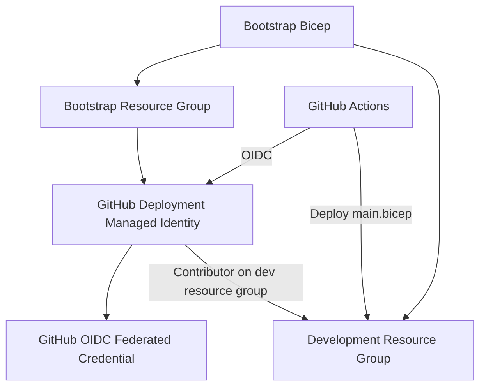
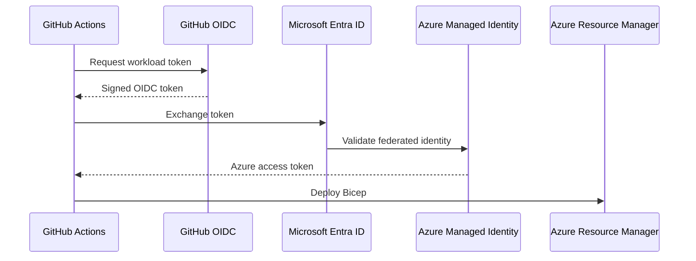
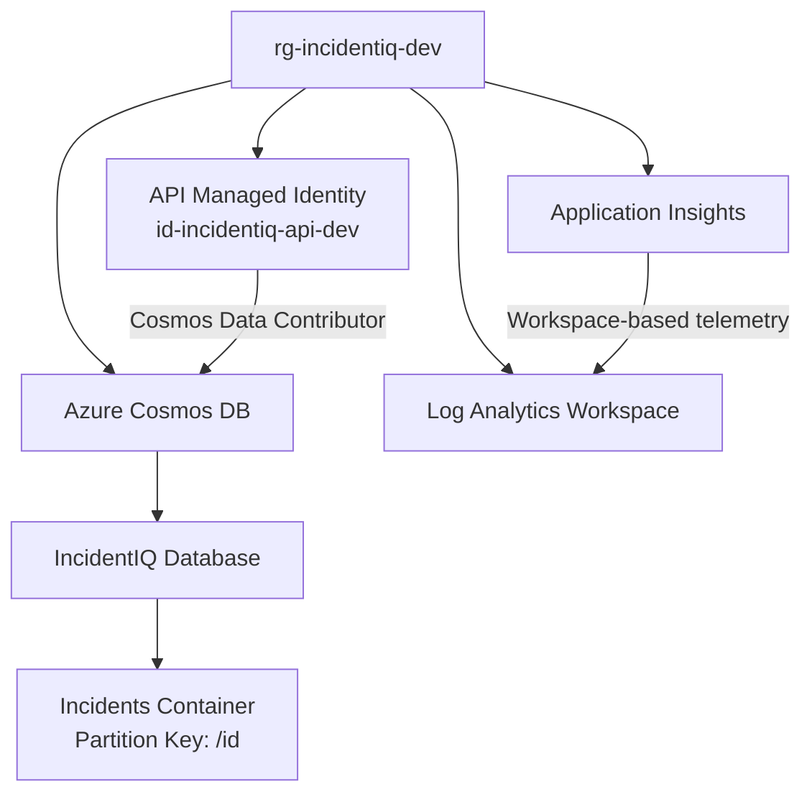
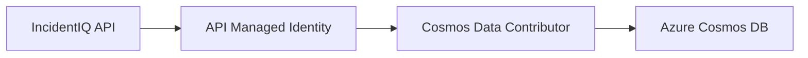
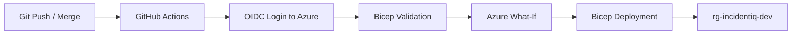
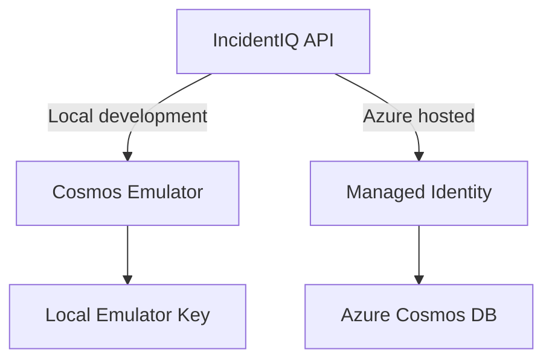
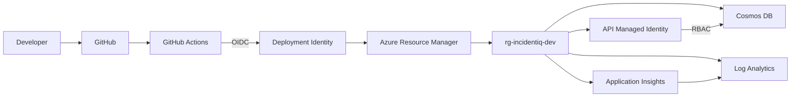

# IncidentIQ Infrastructure

This folder contains the **Infrastructure as Code (IaC)** for IncidentIQ.

Azure resources are defined using **Bicep** and deployed through **GitHub Actions** using **OIDC authentication**. The goal is to keep the development environment reproducible, version-controlled, and easy to recreate without manually configuring resources in the Azure Portal.

---

## Overview

The infrastructure is split into two areas:

- **Bootstrap infrastructure** — creates the Azure resources needed for GitHub to deploy the application infrastructure.
- **Environment infrastructure** — creates the resources used by IncidentIQ itself.



---

## Folder Structure

```text
infra/
├── bootstrap/
│   ├── main.bicep
│   ├── github-identity.bicep
│   └── deployment-role.bicep
│
├── environments/
│   └── dev.bicepparam
│
├── modules/
│   ├── api-identity.bicep
│   ├── application-insights.bicep
│   ├── cosmos.bicep
│   └── log-analytics.bicep
│
├── main.bicep
└── README.md
```

---

# Bootstrap Infrastructure

The bootstrap deployment is intended to be run only when the Azure deployment foundation needs to be created or changed.

It runs at **subscription scope** because it creates resource groups.

## `bootstrap/main.bicep`

Creates:

- `rg-incidentiq-bootstrap`
- `rg-incidentiq-dev`
- GitHub deployment managed identity
- GitHub OIDC federation
- Contributor role assignment for the deployment identity on the development resource group

The deployment identity is deliberately kept in a separate bootstrap resource group.

This means the development resource group can be deleted and recreated without deleting the identity GitHub uses to deploy it.

---

## `bootstrap/github-identity.bicep`

Creates the user-assigned managed identity used by GitHub Actions.

Example:

```text
id-incidentiq-github-dev
```

It also creates a federated identity credential that trusts the GitHub repository and `development` environment.



No Azure client secret is stored in GitHub.

The GitHub environment contains only the identifiers required for login:

```text
AZURE_CLIENT_ID
AZURE_TENANT_ID
AZURE_SUBSCRIPTION_ID
```

---

## `bootstrap/deployment-role.bicep`

Grants the GitHub deployment identity the **Contributor** role on:

```text
rg-incidentiq-dev
```

The role is scoped to the development resource group rather than the entire subscription.

---

# Environment Infrastructure

`main.bicep` is the entry point for the actual IncidentIQ Azure environment.

Environment-specific values are supplied using:

```text
environments/dev.bicepparam
```

The current development environment is deployed to:

```text
rg-incidentiq-dev
```

in:

```text
UK South
```

---

# Current Azure Resources

The development environment currently contains the following core resources:



---

## Cosmos DB

Defined in:

```text
modules/cosmos.bicep
```

Creates:

- Azure Cosmos DB for NoSQL account
- `IncidentIQ` database
- `Incidents` container
- `/id` partition key
- consistent indexing
- Cosmos RBAC assignment for the API managed identity

The development account uses the **Serverless** capability to keep the environment lightweight while usage is low.

The Azure structure is:

```text
Cosmos Account
└── IncidentIQ
    └── Incidents
        └── Partition Key: /id
```

This mirrors the local Cosmos Emulator structure used during development.

---

## API Managed Identity

Defined in:

```text
modules/api-identity.bicep
```

Creates:

```text
id-incidentiq-api-dev
```

This identity is intended to be attached to the IncidentIQ API when it is later deployed to Azure Container Apps.

The identity is granted the Cosmos DB **Data Contributor** role.

This allows the API to eventually access Cosmos without storing an account key.



Local development still uses the Cosmos Emulator account key.

Azure-hosted execution will use Managed Identity.

---

## Log Analytics

Defined in:

```text
modules/log-analytics.bicep
```

Creates the Log Analytics workspace used as the central telemetry store for the development environment.

Example resource name:

```text
log-incidentiq-dev
```

It currently uses a short retention period suitable for development.

---

## Application Insights

Defined in:

```text
modules/application-insights.bicep
```

Creates the Application Insights resource used by the API.

Example:

```text
appi-incidentiq-dev
```

Application Insights is linked to the Log Analytics workspace.

The API will send telemetry using OpenTelemetry and Azure Monitor.

Typical telemetry will include:

- HTTP requests
- application traces
- exceptions
- dependency calls
- metrics

---

# Environment Parameters

`environments/dev.bicepparam` contains configuration specific to the development environment.

For example:

```bicep
using '../main.bicep'

param location = 'uksouth'
param projectName = 'incidentiq'
param environmentName = 'dev'
```

Future environments can use the same `main.bicep` and modules with different parameter files.

For example:

```text
environments/
├── dev.bicepparam
├── test.bicepparam
└── prod.bicepparam
```

Only `dev` currently exists.

---

# GitHub Actions Deployment

Infrastructure deployment is handled by GitHub Actions.

The important workflows are:

```text
.github/workflows/
├── infra-validate.yml
└── infra-deploy.yml
```

## Validation

Pull requests containing infrastructure changes run Bicep validation.

This catches template or parameter errors before deployment.

## Deployment

Changes merged into the deployment branch trigger the development infrastructure workflow.



The workflow uses:

```text
az deployment group what-if
```

before the actual deployment so the expected changes can be inspected in the job output.

The deployment itself uses:

```text
infra/environments/dev.bicepparam
```

which references:

```text
infra/main.bicep
```

---

# Local vs Azure Development

IncidentIQ keeps the local Cosmos Emulator workflow alongside Azure.



### Local

```text
API
→ Cosmos Emulator
→ Account key authentication
```

### Azure

```text
API
→ DefaultAzureCredential
→ Managed Identity
→ Cosmos RBAC
→ Azure Cosmos DB
```

The local emulator remains useful for fast development and automated testing without requiring Azure.

---

# Resource Ownership

| Resource | Defined In | Purpose |
|---|---|---|
| Bootstrap resource group | `bootstrap/main.bicep` | Holds deployment identity |
| Development resource group | `bootstrap/main.bicep` | Holds IncidentIQ dev resources |
| GitHub deployment identity | `bootstrap/github-identity.bicep` | Allows GitHub Actions to authenticate to Azure |
| GitHub federated credential | `bootstrap/github-identity.bicep` | Enables secretless OIDC authentication |
| Deployment RBAC | `bootstrap/deployment-role.bicep` | Allows GitHub to deploy into the dev resource group |
| Cosmos DB | `modules/cosmos.bicep` | Incident persistence |
| IncidentIQ database | `modules/cosmos.bicep` | Main Cosmos database |
| Incidents container | `modules/cosmos.bicep` | Stores incident documents |
| API managed identity | `modules/api-identity.bicep` | Azure identity for the API |
| Cosmos RBAC | `modules/cosmos.bicep` | Allows API identity to read/write Cosmos data |
| Log Analytics | `modules/log-analytics.bicep` | Central telemetry workspace |
| Application Insights | `modules/application-insights.bicep` | Application telemetry and tracing |

---

# Deployment Commands

## Validate

From the repository root:

```powershell
az bicep build --file infra\main.bicep --stdout | Out-Null
az bicep build-params --file infra\environments\dev.bicepparam --stdout | Out-Null
```

## Preview

```powershell
az deployment group what-if `
    --resource-group "rg-incidentiq-dev" `
    --parameters "infra/environments/dev.bicepparam"
```

Normal deployments should be performed through GitHub Actions rather than manually.

---

# Design Principles

The infrastructure follows a few simple rules:

- Azure resources are defined in Bicep before being deployed.
- Resource-specific configuration lives in reusable modules.
- Environment-specific values live in `.bicepparam` files.
- GitHub Actions uses OIDC rather than Azure client secrets.
- Deployment permissions are scoped to the development resource group.
- Application workloads use Managed Identity where practical.
- Local development remains independent through the Cosmos Emulator.
- `main.bicep` acts as the composition root for the IncidentIQ Azure environment.

---

# Current Infrastructure Flow

At a high level:



As IncidentIQ grows, additional services such as Container Apps, Service Bus, Azure AI, Key Vault and Event Grid will be added as new Bicep modules and composed through the same `main.bicep`.
